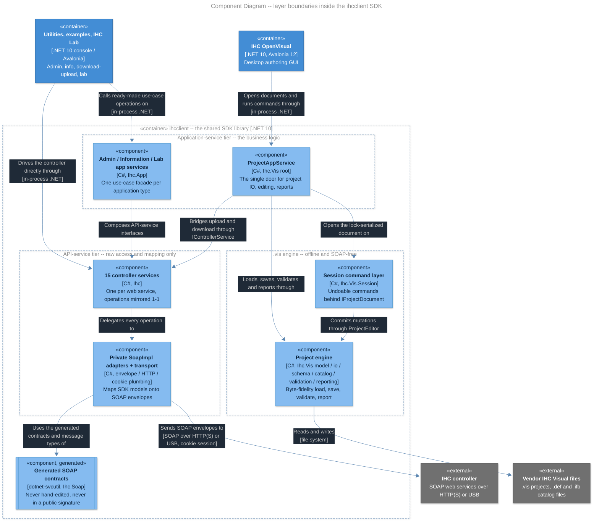

# Architecture

> Single-file architecture overview (matklad `ARCHITECTURE.md` convention) for the IHCClientSDK mono-repo. Read in 15-30 minutes; it covers the stable, high-level structure and the rules that hold across the codebase. File-level detail lives in the per-project READMEs and in the XML doc comments next to the code. Revisit a couple of times a year, and whenever a layer boundary or an enforced invariant changes -- not per commit.

- [Problem Overview](#problem-overview) -- what the SDK is for, and the two problems it solves
- [Codemap](#codemap) -- the top-level modules, one line each, and the entry points
- [Architectural Invariants](#architectural-invariants) -- the rules a contributor or agent can rely on, and what enforces each
- [Layer Boundaries](#layer-boundaries) -- dependency direction inside the SDK, the two service tiers and what each is for, and the two external boundaries
- [Cross-Cutting Concerns](#cross-cutting-concerns) -- configuration, secrets, observability, sessions, async, errors
- [Design Challenges](#design-challenges) -- why the shape is what it is, and the patterns each answer is built from
  1. [Round-tripping a format someone else owns](#1-round-tripping-a-format-someone-else-owns)
  2. [Allocation order is observable output](#2-allocation-order-is-observable-output)
  3. [Editing an immutable model](#3-editing-an-immutable-model)
  4. [Identity that survives tree rebuilds](#4-identity-that-survives-tree-rebuilds)
  5. [Validation as data, not control flow](#5-validation-as-data-not-control-flow)
  6. [Keeping a generated integration layer out of the public API](#6-keeping-a-generated-integration-layer-out-of-the-public-api)
  7. [Business logic out of the frontend](#7-business-logic-out-of-the-frontend) · [7a. A dialog is data, not a window](#7a-a-dialog-is-data-not-a-window)
  8. [Testing what you are not allowed to touch](#8-testing-what-you-are-not-allowed-to-touch)
  9. [Observability without imposing a stack](#9-observability-without-imposing-a-stack)
  10. [An embedded catalog you can trust](#10-an-embedded-catalog-you-can-trust)
  11. [Running without the vendor installed](#11-running-without-the-vendor-installed)
  - [Deliberate non-patterns](#deliberate-non-patterns)
- [Glossary](#glossary) -- the project's recurring vocabulary

## Problem Overview

IHCClientSDK is an **unofficial, community-built .NET SDK** for IHC (Intelligent House Concept) home-automation controllers from LK/Schneider Electric. The vendor has never released a public SDK; this project fills that gap for experienced .NET developers who want to integrate with their IHC installation from C#/F# on Windows, macOS, or Linux. It is not affiliated with or supported by the vendor, targets v3.0 controllers, and is distributed as source under Apache-2.0 -- consumers reference the `ihcclient` project directly (no NuGet package yet, per the root `README.md`).

The SDK solves two distinct problems:

1. **Talking to a live controller.** IHC controllers expose SOAP web services. `dotnet-svcutil` supplies the generated service contracts, request/response types, and `ClientBase` proxy classes in `generatedsrc/`, but the SDK does not use those generated proxy classes as its transport. Private `SoapImpl` adapters implement the generated contracts and send custom SOAP envelopes through the SDK's own `HttpClient`/cookie plumbing. The high-level controller API (`AuthenticationService`, `ResourceInteractionService`, and one service class per controller web service) exposes SDK models rather than SOAP types; controller I/O operations are asynchronous.
2. **Editing IHC project files offline.** A controller's configuration is authored in the vendor's Windows-only "IHC Visual" desktop application and stored as a `.vis` XML project file. The `Ihc.Vis` subsystem is a pure-C# engine that loads, validates, edits, creates, saves, and generates the finished documentation reports (three kinds × Standard/Full, as HTML or plain text) from these files without requiring an IHC Visual installation, using a catalog of stock components embedded in the SDK. Byte-exact round-tripping of an unchanged file is an explicit save mode rather than the default (Architectural Invariant 2). The engine is the backend for the cross-platform GUI under `applications/ihc_openvisual`.

Most other projects in the repository -- examples, utilities, GUI applications, and six test suites -- exercise, demonstrate, or ship tooling on top of that library. The project is an early preview/beta.

## Codemap

`ihcclient/` is the shared library nearly everything references. `shared/ihc_appbootstrap/` is a second, far smaller one, carrying only the telemetry bootstrap the two Avalonia apps have in common. The HTTP proxy recorder and project IO extractor are independent executables.

- **`Directory.Build.props`** / **`Directory.Packages.props`** (repository root) -- build policy and package versions for every project, stated once. `Directory.Build.props` sets `TargetFramework`, `TreatWarningsAsErrors` and `Nullable`; `Directory.Packages.props` enables Central Package Management, so a `PackageReference` names a package and never a version. A project that needs an exception overrides it locally, which makes the exception visible instead of leaving it as one drifting copy among all the rest.
- **`Directory.Build.targets`** / **`BannedSymbols.txt`** (repository root) -- the compile-time symbol bans that apply everywhere, currently the generated `Ihc.Soap` layer. The targets file is imported *after* each project body, which is what lets a project opt out with a property it sets itself (`UsesGeneratedSoapLayer`); three do, and that property is how they are found. The GUI carries a second, project-scoped ban file of its own ([Architectural Invariants](#architectural-invariants)).
- **`ihcclient/`** -- the SDK (namespace roots `Ihc`, `Ihc.App`, `Ihc.Vis`, `Ihc.Soap`). Target `net10.0`, set once for the whole repo in the root `Directory.Build.props`.
  - `wsdl/` + `download_wsdl.sh` / `generate.sh` -- vendor WSDL files and the (macOS-only) scripts that regenerate the SOAP layer.
  - `generatedsrc/` -- `dotnet-svcutil` output, one file per controller web service (`authentication.cs`, `resourceinteraction.cs`, `controller.cs`, ...), namespaces `Ihc.Soap.*`. The high-level layer consumes its contracts and message types; the generated `*ServiceClient : ClientBase<...>` proxy classes are compiled but are not referenced by handwritten code. Regenerated, never hand-edited.
  - `src/soap/` -- the custom SOAP envelope, XML serialization, and WSDL-date helpers used by the custom transport (`envelope.cs`, `serialize.cs`, `wsdate_extensions.cs`).
  - `src/api/` -- the high-level controller API: the general, unopinionated tier, carrying raw access and SOAP↔model mapping but no business logic ([the two service tiers](#layer-boundaries)). `services/` holds one service class per generated SOAP service contract; the shared `IIHCApiService` contract and custom `ServiceBaseImpl` transport base are in `serviceBase.cs`. Every service whose contract declares operations delegates to a private `SoapImpl` adapter implementing it -- `ProductionTestService` is the one exception, a placeholder wrapper with no adapter because its contract declares nothing to adapt. `models/` holds the SDK's own public data types; `util/` holds HTTP, cookie-session, polling, validation, security, network, and date plumbing.
  - `src/app/` -- application services (`Ihc.App`, contract `IIHCAppService` in `services/serviceBase.cs`): `AdminAppService` (administrator settings with change tracking and JSON export), `InformationAppService` (read-only controller info), `LabAppService` (dynamic service/operation invocation for the lab GUI), and `ProjectAppService` (the primary facade over the `Ihc.Vis` engine, including the optional controller upload/download bridge, the unified categorized verification (`Validate` structural-only, `ValidateCategorized` adding the advisory Documentation findings, `ValidateStructured` returning that same categorized run in the engine's own finding shape so a frontend keeps each finding's related sites) and finished-report generation (`GenerateReport`: kind × mode × mimetype to a stream or file, with an optional caller icon mapping)). `models/` contains the admin and information view models. Each is a use-case-tailored business facade aimed at one kind of application, and each is where the business logic lives -- a level of abstraction above the API tier it composes, not a thin wrapper over it ([the two service tiers](#layer-boundaries); Glossary, *application service*).
  - `src/vis/` -- the project-file engine, one folder per `Ihc.Vis.*` namespace:
    - `model/` -- the immutable `ProjectElement` tree and value types;
    - `io/` -- `ProjectReader` / `ProjectSerializer` / `Canonicalizer` / `IdAllocator`, the byte-fidelity read/write core;
    - `schema/` -- `ProjectSchemaRegistry` and the embedded `CanonicalDtdBlocks.dtd` (the single source of truth for the `.vis` inline DTD);
    - `addressing/` and `programs/` -- the small domain-fact tables the read side and the GUI both consult: dataline addressing (`DatalineAddress`) and the program token catalog (`ProgramMethodCatalog` -- templates, operand counts, categories);
    - `catalog/` -- catalog sourcing and composition. The `ICatalog` implementations are `MaterializedCatalog` (source-agnostic in-memory data), `BuiltInCatalog` (the SDK-embedded catalog; its `definitions/` folder holds the three committed definition files), and `CompositeCatalog` (overlays imported definitions). `CatalogDiscovery.FromInstallDir` scans a vendor installation; `CatalogReader` reads individual `.def`/`.ifb` files; the folder also contains the catalog-file writer/parser;
    - `products/` and `functionblocks/` -- code-authoring builders (`ProductDefinitionBuilder`, `FunctionBlockDefinitionBuilder`, `FbProgramBuilder`) that define catalog components entirely in C#;
    - `editing/` -- `ProjectEditor`, the mutable edit session opened via `project.Edit()`, plus `InsertTransform` and link/copy policies;
    - `session/` -- the `Ihc.Vis.Session` command layer (`ProjectDocumentSession`, `ProjectCommand`, `ProjectChangeSet`, `ProjectIndex`, and the per-family command records): the GUI-facing mutation route that wraps `ProjectEditor` operations as undoable **command objects** carrying a change set for keyed tree reconciliation. `project.Edit()` stays the low-level entry point; GUIs use commands. The session implements the root-namespace **`IProjectDocument` port** (obtained from `ProjectAppService.OpenDocument` -- the interactive door; the stateless `Apply`/`CanApply`/`Preview` facade is the one-shot door) and is **lock-serialized** (crudarch D04, superseding the earlier thread-affinity): a private `System.Threading.Lock` serializes member bodies, any thread may read while one mutates, and `Changed`/`StateChanged` are raised outside the lock synchronously on the mutating thread -- so a GUI mutates only on its UI thread while background readers stay legal. History is unbounded by default (`HistoryPolicy.Unlimited`);
    - `projects/` -- `Project`, `NewProjectBuilder`, and the File-New template;
    - `problems/` -- the neutral `Ihc.Vis.Problems` value layer any other namespace may carry: `Problem` and `ProblemCode`, the two composition shapes (`ProblemChain`, one failure restated more precisely; `ProblemAggregate`, a head over N independent items), the `IProblemCarrier` a refusing exception implements so one catch shape covers every coded refusal, the `RefusalIdentity` a site below the validation engine refuses with, and `ProblemTemplate`, the one slot substitution every binder in the SDK goes through;
    - `validation/` -- the catalogue-driven rule engine: `ProblemCatalog` and its entries, `RuleBuilder`/`RuleSet` and the rule families registered in `ProjectRules`, the `WholeProjectValidator` executor, the field-metadata face over the same rules, and the findings model (design challenge 5);
    - `reporting/` -- the internal report pipeline behind `ProjectAppService.GenerateReport`: per-kind builders project the tree into a mode-tagged **shape document** (a closed layout vocabulary; Full-only shapes and fields are declared metadata), `ReportModeFilter` selects the mode, and one generic writer per format (`HtmlReportWriter`, `TextReportWriter`) owns every format rule -- so content and both formats cannot drift apart. The public contract types (`ReportKind`, `ReportMode`, `ReportMimeTypes`, `IReportIconProvider`) live in root `Ihc.Vis`; the writers depend only on the shape document and icon contract, never on the project model (arch-enforced); the committed report oracles pin the output byte-for-byte.
    - the folder root is the `Ihc.Vis` namespace itself -- the public contracts and the extension-member read surface (`IProjectDocument`, `ProjectApplyResult`, the report contracts, `ElementKind` / `ElementView` / `ProjectProjections`) that let a caller browse a project without reaching into any subfolder.
  - `src/config/` -- `IhcSettings`, settings-encryption metadata, assembly metadata, and `Telemetry` (the SDK-wide `ActivitySource`). Controller API services and most application facades receive `IhcSettings` at construction; `LabAppService` instead accepts it later, in `Configure`.
  - `src/security/` -- `SimpleSecret`, AES-256-GCM encryption used for passwords in settings files.
  - `src/util/` -- shared reflection metadata (`ServiceMetadata`) used by the lab's dynamic operation browser and recursive copy/transform infrastructure (`CopyUtil`) used by application models.
- **`applications/ihc_openvisual/`** -- incubating Avalonia MVVM GUI (IHC OpenVisual, a replacement for the vendor's IHC Visual). It and the broad `tests/safe_visual_tests` headless GUI regression suite are in `IHCClientSDK.sln`. The app is cross-platform, and its headless suite is deliberately run on a Linux runner as well as a Windows one: the Linux leg is the only one that can catch a portability defect (a font resolved from the platform instead of the embedded one, a path or accelerator assumption) that is invisible on Windows.
- **`utilities/`** -- console/GUI tools shipped with the repo: `ihc_lab` (Avalonia lab GUI for calling individual APIs), `ihc_admin`, `ihc_info`, `ihc_project_download_upload`, `ihc_project_io_extractor` (standalone parser that generates C# IO-address constants), `ihc_httpproxyrecorder` (standalone ASP.NET proxy for API investigation), and `ihc_settings_encrypt` (password encryption).
- **`shared/ihc_appbootstrap/`** -- the one piece of non-SDK code two projects share: the telemetry bootstrap (`AppTelemetryBootstrap`) that `ihc_openvisual` and `ihc_lab` both reference, factored out rather than duplicated per app.
- **`examples/`** -- `ihcclient_example1` / `ihcclient_example2`, minimal console consumers.
- **`tests/`** -- the test suites (NUnit), split by what they may touch: `safe_unit_tests` (controller-free SDK/business logic, FakeItEasy mocks), `safe_architecture_tests` (controller-free ArchUnitNET layering rules over the SDK and `ihc_openvisual` GUI assemblies), `safe_project_tests` (the `Ihc.Vis` engine, driven by oracle files under its `testdata/`), `safe_lab_tests` (headless Avalonia UI tests for `ihc_lab` against `mock://` services), `safe_integration_tests` (the only suite allowed to call a real controller, restricted to safe operations), `safe_visual_tests` (headless Avalonia UI tests for the `ihc_openvisual` app), and `safe_visual_e2e_tests` (whole-scenario end-to-end tests driving OpenVisual, either as the real desktop application over Windows UI Automation or through an in-process headless driver answering the same verbs).

Entry points: the SDK has no host or DI container of its own -- consumers `new` up services, starting from `AuthenticationService(IhcSettings)` for controller work or normally `ProjectAppService` for project-file work. Public lower-level project surfaces include `ProjectSerializer`, catalog readers/builders, and `project.Edit()`. Each utility/example/application is a normal `Program.Main`. CI is `.github/workflows/build-validation.yml`; it builds the solution on all three desktop platforms and runs every suite except `safe_integration_tests`, which is compiled but never executed against a controller. `safe_visual_e2e_tests` runs only in its headless mode and only with the desktop-bound scenarios filtered out, so no CI leg needs a screen. The per-suite runner matrix lives in that workflow rather than here, because it changes with the runners rather than with the architecture.

## Architectural Invariants

Rules a contributor or agent can rely on, with their scope stated explicitly. Where a test or runtime mechanism verifies a rule it is named; where nothing does, the rule is a convention.

1. **Generated code is never hand-edited.** `ihcclient/generatedsrc/` (from WSDL, via `generate.sh`) is machine-authored and may only change by regeneration; this is convention only (documented in `ihcclient/README.md`). The embedded catalog under `ihcclient/src/vis/catalog/definitions/` was originally bootstrapped by a generator but is **no longer generator output** -- the three definition files are committed, hand-maintainable source, compiled and analyzed like any other (they carried a `.g.cs` suffix while that was still true, and dropped it once it was not). What still holds mechanically is that they carry no verbatim vendor markup: `VerbatimFreeGateTests` (in `tests/safe_project_tests/products/`) asserts no DTD/prolog token text appears in them or in the definition builders. Because they are hand-maintainable, a second gate pins what they *evaluate to*: `BuiltInCatalogDigestTests` (same folder) SHA-256s the serialized output plus catalog metadata of all 176 definitions -- 100 products, 73 function blocks, the 3 File-New templates -- against digests recorded in the test file. Unlike the reference-catalog differential, which `Assert.Ignore`s without an `IhcVisualInstallDir`, it needs no vendor install and therefore runs in CI. A failure means the named definition no longer produces what it produced when the digests were recorded; it says nothing about whether the new output is *wrong* -- the differential remains the authority on correctness, and a deliberate catalog change is expected to red these tests and be re-recorded via the `[Explicit]` `Record` method.
2. **Byte-exact `.vis` round-tripping is an explicit save mode.** `ProjectSerializer.Serialize(project)` and `ProjectAppService.Save(..., ProjectSaveOptions.PreserveExistingMetadata)` reproduce an unchanged loaded project's bytes, including its inline DTD blocks, whitespace, metadata, and id formatting. `ProjectSaveOptions.Default` intentionally changes `id2`/`modified` and is therefore not byte-identical. Verification: `ProjectByteFidelityTests`, `RoundTripVerificationTests`, and `KnownAnswerTests` in `tests/safe_project_tests/projects/`, plus authoring-replay suites (`AuthoringByteFidelityTests`, `CopyPasteReplayByteFidelityTests`, `EnumValuesReplayByteFidelityTests`) using committed oracles under `tests/testdata/`.
3. **`BuiltInCatalog` is intended to be equivalent to standard LK visual catalog.**
4. **Application services should not be mocked; only `IIHCApiService` implementations should be.** Tests fake the low-level API services (FakeItEasy) and run the real business logic in `Ihc.App` services. The seam follows from the tier split ([Layer Boundaries](#layer-boundaries)): the controller sits behind the API tier, so that is where a fake belongs, while the application tier is the business logic under test. This is stated in the `IIHCAppService` doc comment in `src/app/services/serviceBase.cs` and in `CLAUDE.md`; it is a convention/review rule, not analyzer-enforced.
5. **Tests must be incapable of harming a live controller.** Every suite is named `safe_*` to signal this; only `safe_integration_tests` may talk to a real controller, and only via state-safe operations. The unit and lab suites use FakeItEasy services selected by lab/test setup when the endpoint starts with `mock://`; project tests use files/in-memory models; visual tests use the headless UI. This is convention plus test-fixture design -- nothing mechanically prevents a future unsafe test from being added.
6. **Selected hardware-diagnostic calls are opt-in at runtime.** `InternalTestService` operations guarded as dangerous (including `BurnIO`, SD-card/IO-board tests, production-test completion, and RS485 operations) throw unless `IhcSettings.AllowDangerousInternTestCalls` is enabled. Other state-changing controller APIs use their normal service contracts and are not covered by this flag.
7. **The SDK has no logging dependency, and no OpenTelemetry one either.** There is no `ILogger` usage under `ihcclient/src` and `ihcclient.csproj` references no logging packages. Observability is **traces and metrics**, both emitted through `System.Diagnostics` types that ship with the framework -- the `ActivitySource` and `Meter` paired in `src/config/Telemetry.cs` -- so the SDK still takes no OpenTelemetry package: a `Meter` is BCL, and only a *host* references an SDK or an exporter. Host applications choose their own logging/OTel stack. Both signals are minted at one seam (invariant 11).
8. **Every project treats warnings as errors, and the analyzer rule set is chosen, not inherited.** `TreatWarningsAsErrors` is set once for the repository in `Directory.Build.props`, so a diagnostic is a build failure everywhere rather than in "selected projects". Which diagnostics exist is decided in four files: `Directory.Build.props` pins `AnalysisLevel` (a floating level would let an SDK upgrade red the build with rules nobody opted into) and holds the security category at `All`; `/.globalconfig` opts into the individual correctness rules from the other categories, one line each with the reason it is there; `tests/.editorconfig` turns four of them off for test code, again per rule; and `ihcclient/analyser.config` carries the rules that hold for the SDK **only** — chiefly CA2007, which a library needs and which ADR-001 makes unsatisfiable in the four Avalonia assemblies. Each file carries its own rationale — the measurement behind those choices is recorded in the comments, not here.
9. **High-level controller APIs should not expose SOAP artifacts.** Their service interfaces expose SDK models from `src/api/models/`; private `SoapImpl` adapters consume `Ihc.Soap.*` types internally. The generated types and proxy classes are technically `public` and deliberately so -- `XmlSerializer` binds only public types and the transport hands it the generated message wrappers on every call, so the layer cannot be emitted `internal` (**ADR-003**). Consumers must still not use it: the boundary is held by signature scans, by the repository-wide compile-time ban on the namespace, and by the public-API baseline, which deliberately excludes the generated layer so the baseline states what the SDK promises.
10. **A refusal is user-facing Danish text; a failure is an English diagnostic for the log.** The two are told apart by *status*, never by "is there a reason to show" -- `Refused` and `Failed` both carry a non-null `Reason`. A refusal reason is written in Danish in the SDK (FR-2.6 / D13) and forwarded to the installer verbatim; a failure reason is the engine's own exception message, naming element tags, attribute names and `_0x` ids. Verification: `RefusalLanguageTests` (in `tests/safe_project_tests/`) scans the SDK sources for an English refusal in any of its three constructs -- `EditVerdict.Refuse`, `EditRefusedException`, and a directly-built `Refused` outcome -- and for an English noun in either guard position, with a seeded positive control per scan; on the GUI side `OutcomeReason_IsReadOnlyAtTheChokepoint` and `ExceptionMessages_DoNotBecomeUserFacingText` (architecture tests) pin that only one member decides whether a reason is user-facing, and that an exception message reaches the screen only at named, reviewed call sites -- as detail under a Danish sentence, never as the message itself. The two meet at one point: `ProjectDocumentSession` reports any exception implementing `IProblemCarrier` as `Refused` under the carrier's own code -- an edit-open guard and a refused write both arrive carrying a Danish sentence and a published cause id -- and everything else as `Failed`, whose English text goes to the log rather than to a dialog. A row's two texts bind from the same declared arguments through `ProblemTemplate`, so the English diagnostic that reaches the log names the same attribute the Danish sentence does instead of carrying its slots as literal placeholders.

11. **Spans and instruments are minted at one seam.** No SDK or GUI type calls `ActivitySource.StartActivity`, constructs a `Meter`, or creates an instrument. Spans come from `OperationTelemetry` (`ihcclient/src/config/OperationTelemetry.cs`), which owns the naming, the duration, the outcome on both signals, the normalized `error.type` and the fail-open guarantee; instruments are declared by exactly one registry per layer -- `SdkTelemetryRegistry` for the SDK, `ihc_openvisual.Configuration.AppTelemetryRegistry` for the host -- so every instrument's name, unit and description has one home a reader can find. Verification: `TelemetryCoreArchitectureTests` (in `tests/safe_architecture_tests/`) scans the recorded IL edges of both assemblies for the three bypass shapes, reaching into compiler-generated async state machines because a bypass written in an `async` body is emitted on one. Its exemption roster is **empty** -- only the core and the two registries are excluded, and needing `ActivityKind.Client` or an `ActivityLink` is explicitly not grounds for an exemption, since both are parameters of the core's own entry points (asserted, not merely stated). An empty roster over a clean subject is indistinguishable from a broken detector, so seeded violators in `ArchitectureDetectorSeeds.cs` prove each of the three scans can fail. The provider side is split for the same reason it is enforced: `shared/ihc_telemetrybootstrap/` builds the tracer, meter and logger factory with no UI dependency, so a console utility gets the pipeline without Avalonia, and `BootstrapSplitArchitectureTests` fails if an Avalonia edge appears there.

Architecture tests run via ArchUnitNET in `tests/safe_architecture_tests/`, with one shared IL model per compiled assembly and the rules split into focused fixtures by concern -- GUI command state, threading, stock controls, automation peers, control contracts, host portability, and the isolation of the product-dialog metadata layer. Beyond directional layering they pin independently valuable invariants with positive controls: **one command-execution door** (interactive GUI edits never call the stateless `Apply`/`CanApply`/`Preview` facade); **one lifecycle owner** (only `ProjectWorkflow` opens and drives an `IProjectDocument`); **no toolkit-declared competing gates** (no `[NotifyCanExecuteChangedFor]` or `[RelayCommand(CanExecute = …)]`; arbitrary hand-written `ICommand.CanExecute` code is outside this detector's claim); **UI-thread continuations** (a blanket, exemption-free `ConfigureAwait` ban); **no self-launched processes** (`Process.Start` is banned outright, so files and URLs go through Avalonia's `ILauncher`, which resolves the per-platform handler that `UseShellExecute` only emulates); **no directly retained project snapshots** (no instance/static GUI field stores `Project` or `ProjectElement`, including through collections and value wrappers; delegates are opaque, and `ProjectTreeProjector` is the audited transient exception); and **one decision point for user-facing text** (see invariant 10 below).

Six of the GUI's whole-assembly prohibitions are not architecture tests at all: **compile-time banned-symbol entries** carry them, so a violation is a build error on the offending line instead of a later test failure. The repository-wide file holds the bans that apply everywhere; `applications/ihc_openvisual/BannedSymbols.txt` holds the GUI's own -- no `System.Xml`, no `Ihc.Vis.Io`, no `Ihc.Vis.Editing`, no `Ihc.Vis.Reporting`, and not the concrete `ProjectDocumentSession` runner -- and the two files merge for that project. **ADR-004** states which mechanism carries which rule: a symbol ban takes a rule only when it states it exactly, meaning a whole-project ban on a namespace or a single type that also covers members added later; a rule needing a roster of our own evolving API, an exemption for named types or members, or sight of `.axaml` markup stays a fitness test. Because a ban entry is a *string*, renaming one of its targets would empty it silently -- the one failure mode a symbol ban has that an anchored rule does not, so `GuiLayerAnchors_ResolveToTheirDocumentedNamespaces` pins that those names still resolve.

On the SDK side, recursive public-signature scans close `IProjectDocument` against `Ihc.Vis.Editing`, `Ihc.Vis.Io`, and the concrete `ProjectDocumentSession`; they also ensure high-level `IIHCApiService` contracts and implementations expose no `Ihc.Soap.*` artifacts. A further rule isolates the product-dialog metadata layer from the byte-fidelity writers: neither `ProjectSerializer` nor the catalog-file writer may depend on it, so what a dialog offers can never influence what a file serializes to. And one rule holds *inside* a method rather than across a type: a command's `Execute` body may construct no exception but `EditRefusedException`, since the exception type is what decides whether a miss reaches the installer as a Danish refusal or the log as an English failure.

**Decision records.** Significant architecture decisions are recorded as ADRs under `docs/adr/` -- **ADR-001** fixes the repository's threading and concurrency model -- single-threaded by default and concurrent by exception: single-UI-thread ownership of UI-bound state in the Avalonia GUI apps (the lock-serialized document permits off-thread reads), plus the SDK-side contract that makes background work legal (a compute door over an immutable snapshot holds no per-run state, so any thread may call it) and the five-step host contract for running one and binding the result back, **ADR-002** records the thick-SDK/thin-app split across both halves of that seam -- the two-tier service layering (protocol, project-file and business logic stay in `ihcclient`, "business logic" meaning validation, undo/redo and edit legality as much as workflow, all stated as GUI-free facts -- the SDK names no menu or toolbar, it makes one possible -- leaving applications and tools as thin shells that turn those facts into an interface) and, as its second question, the placement of the whole validation rule set behind the facade doors, **ADR-003** settles that the generated SOAP layer stays public because `XmlSerializer` binds only public types, and **ADR-004** divides enforcement between compile-time symbol bans and architecture tests by whether a ban can state the rule exactly. A new architecturally significant decision belongs there rather than in this document; the [Design Challenges](#design-challenges) below explain the shape that results, not the deliberation behind each choice -- the exception being challenge 5, which is itself the record for the validation engine's *shape*, so its options and flip conditions are argued there; where that engine lives, and what a frontend may do with it, is ADR-002's second question. Additional rationale lives in XML doc comments, per-project READMEs, and `CLAUDE.md`.

## Layer Boundaries

**Repo-level direction.** Applications, examples, tests, and most utilities depend on `ihcclient`; the standalone `ihc_httpproxyrecorder` and `ihc_project_io_extractor` do not. No project reference from `ihcclient` points to another repository project, so it remains the bottom of the shared project-reference graph.

The map below is the whole of this section in one picture: which door each consumer comes through, and which way dependencies may point once inside. The rest of the section is its prose.

*Legend* -- mid-blue = a deployable **container**; light blue = a **component** inside the SDK, the double-barred one being **generated** code; grey = an **external** system the repo does not own; dashed frames = layer **boundaries**; every arrow points the one direction a dependency may take. What the picture cannot show is what is *forbidden*: no arrow may run upward (`ApiServiceLayer_DoesNotDependOn_AppLayer`), the `.vis` engine has no path to the SOAP stack (`Vis_DoesNotDependOn_Soap`) and only `ProjectAppService` may bridge it up to the application tier (`VisEngine_DoesNotDependOn_AppLayer`), and no application service may reach the generated layer directly (`AppLayer_DoesNotDependOn_Soap`). The GUI's own bans are listed under *Isolated GUI boundary* below.

**Inside the SDK, the controller-facing stack is layered strictly downward:**

`Ihc.App` application services → `Ihc` API services (`IIHCApiService`) → private `SoapImpl` adapters using generated `Ihc.Soap.*` contracts/message types → `ServiceBaseImpl` + `src/soap/` envelope/serialization + `src/api/util/` HTTP/cookie plumbing → the controller.

The generated `*ServiceClient : ClientBase<...>` proxy classes are not a transport stage in this path; no handwritten source references them. They remain compiled because the generated files and their contracts depend on the `System.ServiceModel.*` packages.

**The top two boxes are two different levels of abstraction with two different aims** (ADR-002), and that difference is the first thing to understand before picking an entry point. The API tier answers *"let me call the controller"*; the application tier answers *"give me the backend for this kind of application"*. **Business logic belongs in the application tier** -- an API service holds only raw access to one web service's functionality plus the mapping between SOAP artifacts and SDK models, and deliberately no business rules, no workflow, and no state a use case would need.

| | **API-service tier** -- `Ihc`, `src/api/services/` | **Application-service tier** -- `Ihc.App`, `src/app/services/` |
|---|---|---|
| Contract | `IIHCApiService` | `IIHCAppService` / `AppServiceBase` |
| Unit | One class per controller **web service** (15), operations mirrored **1-1** with the SOAP contract | One class per **application type** (4: administration, controller information, lab exploration, project authoring), operations shaped by a use case |
| Aim | General and unopinionated: everything the controller can do, raised to SDK models and async idioms | Use-case-tailored: does the hard work -- business logic and controller integration -- so a frontend is left with wiring |
| Logic it holds | Raw access and mapping only: envelope/transport plumbing and SOAP↔model translation. **No business logic** | The business logic -- the reason the tier exists |
| A single call | One operation on one web service | A use case that normally spans several API services -- and for `ProjectAppService` an engine that speaks no SOAP at all |
| Opinions | None beyond transport and models; the caller owns authentication, sequencing, and state | Deliberate: auto-authentication on demand, change tracking, aggregation, snapshot/dirty state, refusal policy |
| State | Effectively per-call; session state sits in the shared cookie handler | May own use-case state -- `AdminAppService`'s last-retrieved snapshot, `LabAppService`'s selection, an open `IProjectDocument` |
| Built from | `IhcSettings` (`AuthenticationService`, `OpenAPIService`) or an `IAuthenticationService` | `IhcSettings`, creating the API services it needs -- or those API services injected |
| Reach for it when | You want direct controller access and will drive the workflow yourself | You are writing an application of that type and want its behavior ready-made |
| In tests | **Faked** (FakeItEasy) -- this is the seam | **Never faked**: the real business logic is what is under test (Invariant 4) |

Keeping the two apart is what lets each stay simple: folding auto-authentication and change tracking down into the mirror tier would force those opinions on an integrator who wants one raw call, while having only the mirror tier leaves every frontend to rebuild the same workflow (ADR-002 options 3 and 2). The tiers are therefore a choice, not a ladder -- a consumer enters at whichever level fits and is not expected to descend below them. Dependencies point strictly downward: an application service composes API-service interfaces (or the settings from which it creates them) and SOAP-free engines, and an API service never knows an application service exists (`ApiServiceLayer_DoesNotDependOn_AppLayer`, with `AppLayer_DoesNotDependOn_Soap` as its upward complement -- an application service reaches the controller only through API-service interfaces). `ProjectAppService` is the one member of the application tier that does not live in `Ihc.App`: it derives from `AppServiceBase` but sits in the `Ihc.Vis` root beside the engine it fronts, and is the single type allowed to bridge that engine up to the application tier (`VisEngine_DoesNotDependOn_AppLayer`).

**The `Ihc.Vis` engine is a parallel, operationally SOAP-free stack.** Code under `src/vis/` performs no controller/API calls; its runtime work stays within the model, IO, schema, catalog, products, function-blocks, editing, projects, and validation namespaces. It is not a formally isolated assembly or namespace boundary: `CatalogDiscovery` names `IhcSettings` in an error and `ProjectReader` names `IControllerService` in a diagnostic. The operational bridge between the file and controller stacks is `ProjectAppService` (`src/app/services/`), whose optional `IControllerService` parameter provides project download/upload; file-only use passes no controller. Browsing happens on immutable `Project`/`ProjectElement` values, while mutation occurs in a `ProjectEditor` session that commits a fresh snapshot via `ToProject()`.

**Public vs internal surface.** The intended high-level surface is the API services and their models, the `Ihc.App` services, `IhcSettings`, and `ProjectAppService`. The project engine also deliberately exposes lower-level types such as `Project`, `ProjectEditor`, `ProjectSerializer`, catalogs, definition builders, and validation result/finding models. The rule engine is public too -- `WholeProjectValidator`/`IWholeProjectValidator` over `ProjectRules.Registered` -- but the application tier is the door a frontend uses: `ProjectAppService.Validate` runs it, and the GUI is held to that route by the L5 rule in design challenge 5. Internals are exposed to a closed friend list in `ihcclient.csproj`: `safe_integration_tests`, `safe_unit_tests`, `safe_project_tests`, and `ihc_lab`.

**External boundaries.** The system has two very different "outsides":

- *The controller*, reached over HTTP(S) or USB (`SpecialEndpoints.Usb`, endpoint `http://usb`) using SOAP with cookie-based sessions. All service instances share one process-wide static `HttpClient`; the client plumbing disables automatic cookies, applies the SDK's cookie explicitly, and currently accepts every HTTPS server certificate through `DangerousAcceptAnyServerCertificateValidator`. Certificate identity is therefore not authenticated, leaving HTTPS connections vulnerable to man-in-the-middle interception. `mock://` is a reserved selection signal for lab/test setup (`IhcSetup`); real `ServiceBase` construction rejects that prefix rather than automatically creating fakes.
- *Vendor IHC Visual*, reached through files: `.vis` projects and `.def`/`.ifb` catalog files are a compatibility contract with a closed-source third-party application. Schema/format fidelity and the explicit byte-preserving save mode are therefore architectural requirements: the vendor app must accept, and be untroubled by, anything this SDK writes.

**Isolated GUI boundary.** The thin MVVM GUI holds element ids rather than project-tree object references. It obtains every domain command from `ProjectAppService.Commands` and executes interactive edits through the `IProjectDocument` port returned by `ProjectAppService.OpenDocument`; `ProjectWorkflow` owns that document plus file lifecycle, recent-file concerns, and the continuous whole-project validation over the open document (`ValidationMonitor`) — the debounced background run and the blocking answer a transfer gate reads. That answer is a fact about the DOCUMENT, so it lives beside the document rather than on the Problemer panel: a gate sourced from a presentation component would reopen whenever that component was closed or never built, and the panel is one reader of the monitor like any other. The stateless `ProjectAppService.Apply`/`CanApply`/`Preview` methods are reserved for one-shot non-interactive callers and are forbidden throughout the GUI assembly. Views bind to view-models and may not drive `IProjectDocument`, `ProjectWorkflow`, `ProjectAppService`, or `ProjectCommands` directly. `OpenVisualArchitectureTests` enforces these boundaries, command construction, the report boundary (the GUI composes no report HTML/text -- its single report door is `ProjectAppService.GenerateReport`, called only from `ProjectReportWorkflow`, with the `SvgReportIconProvider` supplying icon fragments through the root-`Ihc.Vis` contract), and retained element identity. Reaching the SDK's internal report pipeline at all, like the other whole-assembly prohibitions, is refused earlier by a banned-symbol entry ([Architectural Invariants](#architectural-invariants)).

## Cross-Cutting Concerns

**Configuration.** `IhcSettings` (`src/config/IhcSettings.cs`) carries endpoint, credentials, application name, catalog-generator input, and behavior toggles. Controller API services, `AdminAppService`, `InformationAppService`, and `ProjectAppService` receive it at construction; `LabAppService` accepts it post-construction through `Configure`. The ignored root `ihcsettings.json` (templates: `ihcsettings_template.json`, `ihcsettings_example.json`) is used by controller-connected examples, utilities, applications, and integration tests. The library and file-only project engine do not require it, and the SDK reads no configuration file unless a caller explicitly uses `IhcSettings.GetFromFile()` or `GetFromConfiguration()`.

**Secrets.** Sensitive fields are marked with `[SensitiveData]`; `AdminAppService` uses that attribute when encrypting/decrypting JSON, while SOAP-request, cookie, user, and admin-model telemetry performs call-site redaction based on `IhcSettings.LogSensitiveData` (default `false`). **Redaction is call-site, not global** -- `ActivityExtensions` does not inspect `[SensitiveData]`, so nothing structurally prevents a call site from attaching a secret-bearing model to an activity tag. Trace data must therefore be treated as sensitive, and a new call site that tags a model is responsible for its own redaction. (Known defects in specific call sites are tracked in `TODO.md`, not here.) Settings-file passwords can be stored with AES-256-GCM (`SimpleSecret`, using `IHC_ENCRYPT_PASSPHRASE`) via `ihc_settings_encrypt`; the settings loaders decrypt them transparently.

**What `LogSensitiveData` also switches on: a linkable fingerprint.** Beyond opening payloads and
credentials, the flag enables a SHA-256 of the exact bytes a project save writes or a load reads
(`ihc.project.content.sha256`, on `ProjectAppService.Save`/`Load`). The digest carries no project
content and cannot be reversed, but it is STABLE: two sessions -- on different days, different
machines, different customers' installations -- that touched byte-identical files emit the same
value, so records that name no file become linkable across the backend, and a file can be
recognised without ever being transmitted. That is exactly what makes it useful when diagnosing a
reported problem ("is this the same project?") and exactly why it is not on by default. The byte
COUNT is recorded unconditionally, because a size reveals nothing comparable.

**Observability.** The SDK emits OpenTelemetry-compatible traces through one `ActivitySource` (`src/config/Telemetry.cs`). Controller-service operations and major application-service operations normally start an activity tagged with service and operation name, but instrumentation is not universal across every public helper/lifecycle method. `ActivityExtensions` attaches supplied objects directly and provides no attribute-driven scrubbing. Exporters and any logging live in the host (utilities configure OTLP export from the `telemetry` section of `ihcsettings.json`).

**Authentication and sessions.** Controller sessions are cookie-based (`CookieHandler` in `src/api/util/cookies.cs`), and non-authentication API services normally share the cookie handler from an `IAuthenticationService`. Raw controller consumers authenticate before protected calls and disconnect on shutdown (hence the README's Generic Host recommendation). `AdminAppService` and `InformationAppService` auto-authenticate on demand. `LabAppService` deliberately exposes authentication as a selectable operation rather than doing it automatically, and `ProjectAppService` assumes its optional injected `IControllerService` already belongs to an authenticated session.

**Async.** Controller I/O operations return `Task`, and long polling is surfaced as `IAsyncEnumerable` (see `ResourceInteractionService.GetResourceValueChanges`) instead of events. Project creation/editing/catalog/validation operations and several application-service controls are synchronous -- by contract, not accident (ADR-001): an SDK compute door runs on its caller's thread over an immutable snapshot, a host that must not block offloads it and binds the result back under ADR-001's host contract, and every `Task`-returning facade door is I/O-shaped rather than a CPU offload. Context capture is enforced mechanically on both sides of the SDK/GUI seam, in opposite directions. In the SDK, CA2007 (invariant 8) makes every await state its `ConfigureAwait` explicitly: most honor `IhcSettings.AsyncContinueOnCapturedContext` (default `false`), while HTTP-handler awaits and a few isolated internals hardcode `ConfigureAwait(false)`. The `ihc_openvisual` GUI carries the opposite rule, a blanket `ConfigureAwait` ban (Architectural Invariants): blanket rather than operand-aware because `ConfigureAwait(true)` is pointless in GUI code, and mechanical rather than review-based because an off-thread continuation can silently lose bound-collection updates.

**Error handling.** The project subsystem defines focused boundary exceptions (`CatalogFormatException`, `ProjectFormatException`, `VisSchemaFormatException`, `ProjectValidationException`, `ProjectUploadException`), while controller communication uses `ErrorWithCodeException` for selected IHC errors. Ordinary argument, IO, invalid-state, unsupported-operation, and a small number of generic exceptions also surface; there is no uniform repository-wide exception taxonomy. Validation additionally exists as data: `ProjectAppService.Validate` returns a `ProjectValidationResult` of structured findings so GUIs can present problems without exception control flow. Where an operation must nonetheless refuse by throwing, the exception carries its problem rather than only its message -- `IProblemCarrier` exposes either a `ProblemChain` or a `ProblemAggregate` (`ProjectValidationException` is the aggregate case, its items being the errors that blocked the operation), so one catch shape covers every coded refusal and a host renders the coded Danish sentence instead of the English exception text.

**Identity and immutability in the project engine.** `.vis` elements carry stable `_0x…` ids; loaded ids are preserved verbatim, new ids are allocated monotonically off the project counter, and deletions leave permanent holes (vendor-compatible behavior, guarded by `AllocatorMonotonicityTests` and `IdAllocatorTests`). The model is immutable; every mutation inside a `ProjectEditor` rebuilds the tree while handles track their target by id.

**External package dependencies.** `ihcclient.csproj` references `Microsoft.Extensions.Configuration*` for optional settings binding and `System.ServiceModel.*` so the generated contracts/proxies compile, even though handwritten transport bypasses the generated proxy classes. It also pins `System.Security.Cryptography.Xml` to a patched 8.x release. Logging and OpenTelemetry SDK/exporter packages belong to host applications rather than the library.

## Design Challenges

The "why is it like this" companion to the Architectural Invariants. Each entry names a **general** problem -- one that is not specific to IHC and for which established patterns exist -- and the mechanism this repo chose. Read it before proposing a simplification: several of these answers look like over-engineering until the constraint behind them is visible. Entries describe intent and mechanism; where an answer is only partly in place the gap is marked, but known defects and remediation work are tracked in `TODO.md`, not here.

Each challenge is followed by the recurring patterns its answer is built from, where naming them adds something the prose does not. In those tables **Layer** reads `SDK` = `ihcclient`, `GUI` = `applications/ihc_openvisual`, `Both` = a contract spanning the boundary; **Enforced** marks a pattern an architecture test fails the build over, rather than a convention.

### 1. Round-tripping a format someone else owns

A `.vis` file must survive load→save byte-for-byte, and anything written must be accepted by a closed-source vendor application whose observable behavior is the only specification. Completeness is impossible: installers author custom components, so any real file may use element types the SDK has never seen. The answer is an **open-world model** -- one universal `ProjectElement` record with no type hierarchy, all type facts held externally and resolved file-DTD-first through `ProjectSchemaView`, with `ProjectSchemaRegistry` consulted only as the fallback for types the file does not itself declare. Unknown types therefore round-trip verbatim and the registry's size is invisible to round-trip. Tolerance is a deliberate three-way policy rather than a blanket: declared by the file → resolves and round-trips; declared by neither → `UndeclaredAttributePolicy.Throw` on serialize; insert/new-project paths → `.Drop`. The DTD is the licence -- this is must-preserve-*declared*-unknowns, not must-preserve-unknowns. Encoding is transparent the same way: a file declaring ISO-8859-1 while carrying UTF-8 bytes round-trips identically and keeps its mojibake as the logical value rather than "repairing" it. Because two notions of "correct" exist, saving makes the choice explicit: `ProjectSaveOptions.PreserveExistingMetadata` reproduces the loaded bytes, `.Default` re-stamps `id2`/`modified` like IHC Visual and is deliberately not byte-identical.

| Pattern | Layer | Where it lives | Problem it solves |
|---------|-------|----------------|-------------------|
| Registry (build once, read many) | SDK | `ProjectSchemaRegistry`, `ProgramMethodCatalog`, `VariableTypeRegistry` over `Frozen*` collections | Puts the static facts of a domain in one table instead of scattered `switch` statements that drift apart as the domain grows. |
| Policy object (strategy as data) | SDK | `DeleteReferencePolicy`, `LinkCopyPolicy`, `ProjectSaveOptions`, `HistoryPolicy`, `InsertOption` | Behavioural variants the caller picks by name, so the engine carries no caller-specific branching and each variant is documented where it is declared. |

### 2. Allocation order is observable output

Ids are not an implementation detail here: the vendor's byte layout depends on the exact sequence in which ids were minted, so an allocator that is *correct* but differently ordered produces a file that differs from the vendor's. `IdAllocator` is therefore monotonic, never reuses or resets, seeds from `max(last_unique_id, MaxCounterPresent, MaxReferencedCounter)` (never trusting a foreign `last_unique_id`, never re-minting a dangling IDREF's counter), and is threaded by explicit constructor injection rather than ambiently. Fidelity work that reads as over-engineering follows directly from this constraint: `InsertTransform.BurnAndMapToExisting` allocates and discards ids on purpose to reproduce the vendor's enum-dedup footprint, `PrependReferencedEnumStubs` synthesizes a stub absent from the source so the existing dedup path burns the same ids, and `SeedIdLayout` exists because different IHC Visual builds seed in different orders. This rules out GUID, lazy, and deferred allocation schemes, and it is why correctness here is settled by replay against oracles rather than by reasoning.

### 3. Editing an immutable model

Browsing wants immutability and cheap snapshots; editing wants mutation. The split is a read type and a write session: `Project`/`ProjectElement` are immutable, and all mutation goes through `ProjectEditor`, opened by the `project.Edit()` extension and committed by `ToProject()`. Internally the editor is **path copying with structural sharing** -- only the spine from root to target is rebuilt, untouched subtrees are shared by reference -- behind one mutable root pointer. It is a unit of work: nothing escapes until commit, so an abandoned session costs nothing -- a caller whose edit fails simply drops the editor, and no rollback path has to exist. (Frontends never see this directly: the GUI is barred from the editing layer and reaches the same guarantee through commands.) `ProjectContracts.AssertCore` adds `[Conditional("DEBUG")]` design-by-contract at the commit point, deliberately not on the passive load→save path. Undo/redo then rides this for free in the `Ihc.Vis.Session` layer: `ProjectDocumentSession` applies **command objects** (each emitting a `ProjectChangeSet` that drives keyed UI reconciliation) but stores the *history* as whole-`Project` snapshots rather than command inverses or diffs, so an undo is a snapshot swap -- structural sharing means a hundred snapshots do not cost a hundred trees. History is unbounded by default (`HistoryPolicy.Unlimited`, optionally `Bounded`), and a cascading edit reverses as one step because a `CompositeCommand` commits as one snapshot and one history entry. An interactive frontend holds this machinery as the **`IProjectDocument` port** from `ProjectAppService.OpenDocument` -- one lock-serialized document per open file, whose undo/redo outcomes carry their exact change sets so the GUI reconciles the tree in place on undo too -- while the stateless `Apply`/`CanApply`/`Preview` facade serves one-shot callers on a throwaway session. **Value equality is part of the immutability contract, and it does not come for free:** a record compares an `ImmutableArray<T>` or `ImmutableHashSet<T>` member by *reference*, so a stored collection silently costs the record the structural equality everything else assumes -- and the symptom is invisible at the declaration, since the code compiles and the type still looks like a value. Stored collections on public value records therefore use `EquatableArray<T>` (ordered) or `EquatableSet<T>` (unordered) from `Ihc.Vis.Model`: small readonly structs over the immutable collections that add content equality and matching hashing, read `default` as empty, and convert implicitly *in* while requiring an explicit `AsImmutableArray()`/`AsImmutableHashSet()` *out* -- the asymmetry keeps dependence on the backing type visible and avoids overload ambiguity. The point is that compiler-generated record equality then covers every stored member **including ones added later**; the previous answer was a handwritten `Equals`/`GetHashCode` pair per record, which had to be kept in sync by hand and demonstrably was not. `ValueCollectionArchitectureTests` enforces this by reflection over declared instance fields, so computed collection views (which have no backing field) are out of scope by construction. Two records keep custom equality **by design**: `DefinitionDocumentation` (map semantics, no dictionary wrapper exists) and `Project` (deliberately omits serialization provenance from logical equality).

| Pattern | Layer | Where it lives | Problem it solves |
|---------|-------|----------------|-------------------|
| Command | SDK | `ProjectCommand` + the per-family records (`src/vis/session/`) | Turns every mutation into a labelled, self-checking, undoable object, so one pipeline (evaluate → execute → commit) serves menus, keyboard, drag-and-drop and one-shot in-process callers alike. Commands are deliberately **not** serializable: there is no macro/scripting surface and no command journal, so history is in-memory only and a crash loses the unsaved session. |
| Composite command | SDK | `CompositeCommand` | A cascading gesture commits as one snapshot and one history entry. All-or-nothing, and the cost of that is a real constraint: every part is evaluated against the **pre-edit** project, never against what the parts before it produced, so a bundle is only valid for parts whose preconditions do not depend on an earlier part having run. Bundling `[Delete(x), Rename(x)]` is the shape of the mistake -- both parts check clean, and the miss surfaces only inside `Execute`, discarding the whole bundle where a one-at-a-time sequence would have committed the delete. The two routes agree on the resulting project exactly when the parts are independent; `CompositeCommandMetamorphicTests` pins that over randomized sequences. |

### 4. Identity that survives tree rebuilds

Since every mutation rebuilds the tree, object references go stale immediately. Two mechanisms answer this. `ElementId` is a `readonly record struct` that exists to prevent one specific bug class: `.vis` writes `_0x…` tokens for ids, IDREFs, `typeid`, `icon`, `product_identifier` and `method` alike, and **only ids and IDREFs are modelled as `ElementId`** -- every other `_0x` token stays an opaque string, so the two can never be conflated. Handles (`ElementRef` and its siblings) never retain a `ProjectElement` node -- that is the invariant, not any one field layout: a handle holds an id (some also the editor they are bound to, or a name where the id is not yet known) and re-resolves against the current tree on access, so it survives the session's per-mutation rebuilds. The GUI likewise holds element ids, never object references. A stale id is an expected condition at **both** resolvers, not an error: callers that can carry on ask `TryResolve`, and the require-or-throw `ProjectEditor.Resolve` answers a miss with an `EditRefusedException` -- a refusal the session reports as `Refused`, in the same Danish sentence the pre-edit `RequireExists` guard composes. Neither resolver treats a vanished element as a fault.

| Pattern | Layer | Where it lives | Problem it solves |
|---------|-------|----------------|-------------------|
| Identity map / index | Both | `ProjectIndex` (rebuilt per commit); the reconciler's `NodeKey` index | Legality probes fired on every pointer event, and row lookups on every change, stop paying an O(N) tree walk each. |
| Memoisation keyed by instance | SDK | `EditAnalysisCache` over a `ConditionalWeakTable` | Re-opening an editor skips the full id/duplicate/attribute scan for snapshots the SDK itself produced; entries vanish when their snapshot is collected, and foreign or hand-mutated projects still take the safe path. |

### 5. Validation as data, not control flow

A GUI needs every problem at once with somewhere to navigate; an irreversible operation needs to refuse. Both come from one mechanism: the validation engine never throws and returns a `ProjectValidationResult` of `(Severity, RuleId, Category, Locator, Message)` findings, with `IsValid` derived from "no Error-severity finding" so warnings never block. **A finding also CARRIES what its catalogue entry declared about it** -- the operations the row refuses, and the attribute the rule is about (`ValidationFinding.RefusedOperations` and `.TargetAttribute`, projected in `WholeProjectValidator.Build` from the entry). **A rule that THREW produces no finding at all**: it is reported on the run's second channel as an `InternalError`, because an engine fault is a defect in the tool rather than a statement about the user's file -- so `StructuredValidationResult` carries `Findings` and `Faults` separately, and a host lists the two apart. Carried rather than looked up, for the reason the layer rules give: a host may not read the catalogue, so the finding is the only door those facts have -- which is what lets a frontend tell a fatal row from an ordinary one, and navigate to the FIELD a finding is about rather than only to its element. It is a declaration, not a promise: whether that attribute is rendered as an editable field is a question about the host's dialogs, which the SDK does not answer. The same module is the unified verification API: `ValidateCategorized` adds the advisory `Documentation`-category checks (always warnings) that feed the Full-mode report appendix, while `Validate` and the save gate stay keyed to the structural category alone. Callers at boundaries that must refuse rather than report -- `UploadTo` (on by default) and `Save` under `ValidateBeforeSave`, and equally the definition builders' `Build()`, which cannot hand back a half-valid catalog component -- convert the result into `ProjectValidationException`, which carries the whole result so nothing re-runs. **The FAULT channel is read first, ahead of validity**: a run that lost a rule to a crash has no verdict to convert, so `Save`/`UploadTo` refuse it under `save-validation-incomplete` before asking `IsValid` -- otherwise "no blocking errors" would be a clean bill of health produced by the crash. It is its own code rather than the errors-found refusal because that sentence counts the errors a user must repair, and a faulted run with none would ask for zero repairs. The same instinct appears where validity and writability diverge: `CatalogGrammarAdvisor` reports grammar problems as non-blocking warnings because authentic vendor files violate them and must keep writing.

**The engine behind it, and which way its layers point.** What produces those findings is a hand-built rule engine, in four parts: a neutral **problem value** layer (`Ihc.Vis.Problems` -- `Problem`, `ProblemCode`, the two composition shapes `ProblemChain` and `ProblemAggregate`, the `IProblemCarrier` a refusing exception implements, and `ProblemTemplate`, the one slot substitution both this layer and the catalogue bind through) that any layer may carry; a **catalogue** (`Ihc.Vis.Validation` -- a `ProblemCatalog` of `ProblemCatalogEntry` declarations, where a code's category, severity, Danish template and declared argument slots live as compiled data); an **executor** (`WholeProjectValidator` over a `RuleSet`, with the shared per-run analyses each rule reads instead of re-walking the document, and the *declared contexts* a rule may need beyond the document itself); and two **engine faces** onto the same rules -- the whole-project run, and the field-metadata read a dialog binds to. `ProjectAppService` composes them; nothing else does. A third question a frontend asks -- *may this edit be applied right now* -- is answered by the SESSION rather than by this engine: it is a command precondition evaluated by the command itself, not a registered rule, which is why an entry of kind `EditPrecondition` declares `RuleFaces.None` and why no executor produces it.

**Which face answers which question, and how a caller reaches it.** The three questions below are not interchangeable, and substituting one for another is the mistake to avoid: `Validate` never answers *may I apply this edit* (it judges a document, not a gesture), and `CanApply` never answers *is this project sound* (it judges one command against the current state).

| Face | Ask it when | The call | Semantics |
|------|-------------|----------|-----------|
| Whole-project run | you need every problem in a document at once, or a boundary must refuse rather than report | `ProjectAppService.Validate` / `ValidateCategorized` -> `ProjectValidationResult`; implicit in `UploadTo`, in `Save` under `ValidateBeforeSave`, and in a definition builder's `Build()`, which convert it to `ProjectValidationException`. `ValidateStructured` is the same run in the engine's own `ValidationFinding` shape, keeping the related sites a grouped rule reports -- the flat result has one locator per finding and nowhere to put them, and reaching them otherwise would mean naming `IWholeProjectValidator`, which L5 forbids a GUI | Collect-all, ordered by the document scan, and ONE pass -- every gate reads a single run rather than starting a pipeline of its own. |
| Command legality | you need to know whether one edit may be applied right now -- a menu gate, a toolbar's enabled state, a drag-over target | `IProjectDocument.CanApply(command)` on the open document: the probe an *interactive* frontend uses, and the only one the GUI may call. The same-named stateless `ProjectAppService.CanApply(project, command)` answers the same question over a throwaway session for one-shot callers (console tools, tests), and the GUI assembly is banned from it, so an interactive gate cannot drift off the document it is gating. Both return an `EditVerdict` carrying a code and the Danish sentence to show verbatim. This one is the SESSION's face, not the engine's: no registered rule produces it | First refusal, not a list: a caller about to act needs the one reason they cannot. A pure query -- it mutates nothing, so a host may re-ask it per pointer event, and a refused apply leaves no undo entry, version bump or dirty flag. |
| Field metadata | a dialog needs a field's bounds, required-ness or allowed set *before* the user commits | `ProjectAppService.DescribeField(target)` -- the facade is the only legal wiring point, since composing a `RuleSet` with a target is business logic. `RuleSet.DescribeField` / `ConstraintsOn` are the engine-side members behind it | Merged across every rule that targets the field AND declares this face, most restrictive wins, and `Unconstrained` for a field no such rule targets -- the honest answer rather than an absence. |

**Why it is hand-built, and the conditions that would change that.** No validation library is used, for reasons that are structural rather than preference: the catalogue entry already declares the message template, severity and code, so a library's `WithMessage`/`WithSeverity`/`WithErrorCode` would be pass-throughs to a fact declared elsewhere; a rule targets a `(tag, attribute)` pair rather than a typed member, because the rule set derives from DTD metadata at runtime and there is no shipped model to write a member selector against; and finding order is derived from the document scan, where a library executes in registration order, so its result would have to be post-sorted. Targets are therefore resolved when a rule registers rather than at compile time -- a generated typed catalog would emit members for ~663 attribute declarations to compile-check 8 literals. Three conditions are recorded as commitments rather than caveats: adopt a library if a majority of new rules would be authored against typed members of a shipped model, or if any rule must become asynchronous (both restated on `RuleBuilder`, which is where an author stands when the question arises); generate a typed target catalog with an analyzer over the string overload if the literal-target population passes ~50, or if a DTD edit ever reaches a release having silently emptied a rule.

**One rule, one body, and which faces follow from it.** A rule is authored through `RuleBuilder` and carries exactly one of two bodies. `.Constrain(...)` is declarative -- an `IValueConstraint` over one `(tag, attribute)` target whose two members are the point: `Check` answers *is this value acceptable* and `Describe` answers *what would be acceptable*, so both engine faces read one definition and a bound cannot be enforced by the validator while a dialog advertises a different one; a `ConstraintSequence` orders several over one attribute and stops at the first failure, because *malformed* and *out of range* about one value is one fault, not two. `.Inspect(...)` is a traversal, for what no single value can express -- reachability, dataflow, cross-element counting -- and is whole-project only, because a traversal has nothing a dialog could bind to. `Build()` refuses the inconsistent combinations where the rule is written rather than where it is collected (`BodyCount` for both bodies or neither, `TraversalCannotServeFace` for a traversal claiming another face). Declarative rows are about one in five (measured: ~9 of the 35 pre-migration ids), so the traversal is the normal case and the constraint the deliberate one. **Where the declarative half actually stands.** Exactly one registered rule is a `Constrain`: `addr-modem-phonenumber-malformed`, over `(sms_modem_phonenumber, phonenumber)`. It is the row that makes the mechanism real rather than reserved -- `RunConstraints` is exercised by it, and `DescribeField` answers with declared lengths and a whitespace ban for that one target instead of `Unconstrained` for every target. Its predicate is *delegated*, not restated: the constraint calls `DialogValueRule.PhoneNumber`, the same object the product dialog and the commit path consult, so the entry's `DeclaredThreshold`s are a governance mirror of one operative pair rather than a second copy of it, pinned equal by a test. `ConstraintSequence` remains authored and unexercised -- no registered row yet needs several ordered failures of one code. The bounds the dialogs actually get still come from the model -- `ElementView.DeclaredBounds` and `SceneValue.LevelConstraint`/`RampPartConstraint`, which is why deleting the hard-coded AXAML clamps cost nothing -- and re-binding a shipped dialog to rule-declared metadata is deliberately not done here. That is also where this row's one honest limitation lives: `Describe` can advertise its lengths and its whitespace ban but has no member for the `+`-prefix that `Check` enforces, so a caller binding the metadata alone would under-advertise it. Migrating the remaining declarative candidates changes which face produces their findings and therefore moves oracles, so it stays feature-sized work rather than a cleanup.

**What a row promises about its findings, and where that promise is kept.** An entry declares a `FindingShape` -- one finding, one per occurrence, or a primary with related sites -- and that declaration is not decoration: it is what tells a consumer whether N findings are N repairs or one, and whether a finding has other sites worth navigating to. It is checked in two places because neither can see the other's half. Registration fails a *declarative* rule that claims a group (`RuleRegistrationFault.ShapeContradictsDeclaration`), since a constraint reports through `Report` and has no way to name a related site; the *emission* fails a traversal that declares a group and then reports a lone site, or reports a group without declaring one -- which a delegate hides from registration. A shape violation is a COMPOSITION error, so it is deliberately outside the executor's report-and-continue net: turning "this rule contradicts its declaration" into one more finding about the user's file is the opposite of what it means. A grouped finding gives every site its own label (the authored name first, because a duplicate id makes every locator read the same), and those sites reach a caller through `ValidateStructured`.

**Three layers refuse below the engine, and each carries its own copy of the sentence.** `Ihc.Vis.Io` refuses a save, `Ihc.Vis.Session` an edit, and `Ihc.Vis.Editing` the read-to-write boundary itself: `edit.open` runs the guards a save would fail on once, before a user invests any work, and refuses under the same published cause id (`attr-undeclared`) the save family raises -- one row with two operations, not two rows. None of the three may read the catalogue (L2, L3), so each states the row's Danish template beside its code as a `RefusalIdentity`; the raising site, the only place that knows the values, binds a copy through `RefusalIdentity.Binding`; and `RefusalLabelDriftTests` keeps the unbound template equal to the catalogue entry's. The `io.save` head is the one operation label that is ever *rendered* rather than merely identified -- it heads the save-validation aggregate -- which is why it alone declares an argument slot.

**Where a shared fact lives, and why a threshold is not the place for one.** An entry's `DeclaredThreshold`s are RULE-ONLY facts: a bound only the whole-project run reads belongs on the entry, as data a rule reads rather than a literal in a rule body. A fact needed by BOTH a gesture and a rule lives BELOW both, and each reads it there. Two shipped examples set the pattern: `ElementView.DeclaredBounds` comes off the grammar and reaches the dialogs and the commit check alike, and `DatalineAddress.MaxDataLine` is the addressing model's own constant that the address rules and the address editor both consult. Putting either on a catalogue entry would make the catalogue the authority for a fact a gesture must enforce before any validation runs -- and a gesture cannot read the catalogue, so the number would have been copied instead. The telephone lengths are the boundary case and show the discipline: the operative pair lives in `DialogValueRule.PhoneNumber` (Products), the entry mirrors it as thresholds for governance, and a test pins the two equal, because a mirror with no pin is just a second owner. **The line moves per row, and one is already time-bounded:** the S0 pulse range is a rule-only fact today -- nothing here gates it at entry -- but the vendor's dialog refuses an out-of-range count at OK, so the first S0-dialog-parity task moves that pair below both and leaves the entry reading it. That is a relocation, never a second copy.

**Declared context, and why it is a port each time.** Two rule families need a fact the `.vis` file does not contain: the capacity rows need the target controller's limits, and `logic-block-locked-content` needs the library body a locked block was inserted from, because an edited value and a library default are byte-identical in the file. Both are declared on the catalogue entry (`RequiresControllerLimits`, `RequiresLibrary`), carried on `ValidationProfile`, and **skipped when the caller has neither** — a rule that guessed the missing fact would make one project valid on one workstation and invalid on the next. The library arrives as `ILibraryBlockSource`, a one-method port stated in terms of `ProjectElement`, with `CatalogLibraryBlockSource` in `Ihc.App` adapting the catalog lazily; the engine never names the catalog, so the layer table below is unchanged by it.

The dependency direction is stated here and enforced by `tests/safe_architecture_tests/ValidationLayerArchitectureTests.cs`, each rule classified under ADR-004's fidelity test as a *fitness function* rather than a symbol ban (all six namespaces share one project, so a project-scoped ban cannot state a rule between them; the rest name rosters of our own evolving API, which ADR-004 keeps out of ban files):

| Rule | What it holds |
|------|---------------|
| L1 | `Ihc.Vis.Problems` reaches `Ihc.Vis.Model` and nothing else in the engine, so a reader, an importer or the controller bridge can carry a coded problem without depending on the validation engine. Asserted over the dependency EDGES, so a new namespace it starts reaching for fails without anyone updating a list. |
| L2 | `Ihc.Vis.Session` does not depend on `Ihc.Vis.Validation`. The direction is Validation -> Session, which is why a session refusal's Danish sentence lives beside its code and a drift test keeps it equal to the catalogue's. |
| L3 | `Ihc.Vis.Io` does not depend on `Ihc.Vis.Validation`, for the same reason: open/save refusals reach for the problem layer. |
| L4 | A definition builder (`Ihc.Vis.Products`, `Ihc.Vis.FunctionBlocks`, `Ihc.Vis.Catalog`) reports findings from its `Build()` and never runs an executor. |
| L5 | The GUI reaches the engine through `ProjectAppService` and `IProjectDocument`: it renders problems and binds dialogs to validation value types, but does not assemble a rule set, does not read the SDK's catalogue, and does not compose SDK validation pieces into glue of its own -- a composition worth having becomes a facade door instead, which is how new validation capability ships (ADR-002). Declaring its own reserved `app.openvisual.*` family through the same schema types is sanctioned (R17) and deliberately permitted. |
| L6 | The ownership partition: the SDK assembly declares no `app.*` code and the GUI declares no SDK-family code (`ProblemOwnershipArchitectureTests`). |

| Pattern | Layer | Where it lives | Problem it solves |
|---------|-------|----------------|-------------------|
| Result object (errors as data) | Both | `EditOutcome`, `EditVerdict`, `ProjectValidationResult`, `ProjectApplyResult` | Legality and failure are values a menu gate can query and a GUI can render, instead of exceptions used as control flow. Rendering them is not uniform, and the difference is a boundary rather than a detail: a **refusal** is a rule the installer can act on, so the SDK writes it in Danish and the GUI shows it verbatim, while a **failed** outcome's reason is the engine's own exception message -- an English diagnostic naming tags, attributes and `_0x` ids -- which is logged and answered with a fixed Danish sentence. Both statuses carry a non-null reason, so the two are told apart by status and never by "is there a reason to show"; `MainWindowViewModel.UserFacingRefusal` is the one place that decides it. The GUI makes two further single-point decisions about a raised problem: `RaisedProblemDisplay` chooses the SHAPE it is shown as -- a carrier's aggregate goes to the aggregate overload of `IDialogService.ShowProblemAsync`, everything else to the shell's framing narrated over its coded cause, because a site that must remember which shape it might receive will eventually forget -- and `ProblemPresenter` renders every one of them, so a refusal carries the same bracketed identity in the status bar and in an inline field error as it does in a dialog. |

### 6. Keeping a generated integration layer out of the public API

The generated SOAP layer is a liability: its types are positional (`inputMessageName7`), its names are WSDL artifacts, and it changes whenever the vendor's WSDL does. The answer is an anti-corruption layer -- each service class holds a *private nested* `SoapImpl` implementing the generated contract, while the public interface exposes only SDK models from `src/api/models/`. The generated `ClientBase` proxies are not a transport stage; the SDK sends its own envelopes. `ResourceValueEnvelopeMapper` shows the intended shape for the mapping itself: extracted, stateless, no I/O, so the 12-kind wire union can be unit- and property-tested in isolation.

| Pattern | Layer | Where it lives | Problem it solves |
|---------|-------|----------------|-------------------|
| Execute-around (shared operation wrapper) | SDK | `ServiceBaseImpl`'s transport helper; `AppServiceBase.RunTraced` | The per-call scaffold -- envelope, cookie session, activity span, error tagging -- exists once instead of being re-inlined in every operation. Not GoF Template Method: the wrapper takes the body as a delegate rather than deferring steps to a subclass override. |

### 7. Business logic out of the frontend

The applications are frontends over a library, so logic that lands in a view-model is untestable headlessly, unreachable from console tooling, and re-implemented by the next frontend. The answer is the `Ihc.App` application-service layer: tech-agnostic, **use-case-tailored business facades** that do the hard work -- business logic and controller integration -- behind one uniform, consistent, easy-to-understand high-level entry point per use case, so a GUI, console app, or web backend can all sit on them with only wiring to write, while the more general lower-level APIs they compose stay public for advanced direct use ([Layer Boundaries](#layer-boundaries) contrasts the two tiers; the rule that decides where a piece of code goes is that business logic lands here and never in the API tier below or the frontend above). `ProjectAppService` is the exemplar -- "the single door" for `.vis` project CRUD, built specifically as the backend `ihc_openvisual` and future project-related apps wire to. `ihc_openvisual` never hand-rolls XML, routes every mutation through the SDK's `ProjectCommands` gateway (`ProjectAppService.Commands` — the single authoring door; `project.Edit()` is the low-level entry beneath it), and delegates classification, row visibility, addressing, program-method semantics (the token catalog -- templates, operand counts, categories), and the documentation reports *entirely* to the SDK -- `ProjectAppService.GenerateReport` returns finished report bytes (content and formatting), so the GUI's reporting surface is only the shared picker dialog plus its `SvgReportIconProvider` icon mapping; the GUI still performs the render-time substitution of the live `%P`/`%S` operand placeholders into its own TREE display labels (a display concern under the boundary rule stated next). View-models are kept free of Avalonia types so they test headlessly, and UI-owned effects sit behind ports in a Humble Object arrangement (`IDialogService` → `AvaloniaDialogService` for real use, `NullDialogService` for design-time and tests; likewise `IThemeService`). **Boundary (ADR-002, Decision):** the SDK owns raw values, legality, selection, and mutation; *display* interpretation of vendor values (label rendering -- composing a row's display string from the raw values and templates it references, such as resolving the live `%P`/`%S` program tokens -- display defaults, and translations such as catalog categories) is deliberately frontend-owned presentation policy -- a future frontend re-implements display conventions by design, never legality. Command-selection and legality logic (the delete/reorder-legality and one-modem/arithmetic/scene-variant slivers, and the events-container/case/enum-state resolvers) now lives in the SDK: every domain command is minted by a factory on the `ProjectCommands` gateway, discoverable from `ProjectAppService.Commands`, and frontends obtain each command from a factory and never construct one directly (a reflection test enforces that every concrete command except CompositeCommand has at least one public factory). `ProjectWorkflow` holds the `IProjectDocument` from `OpenDocument` (which owns undo/redo, dirty and version) and keeps file lifecycle, recent-files and the document's continuous validation (`ValidationMonitor`); command **availability** is single-sourced in the GUI's declarative `CommandRegistry` -- one `CommandSpec` row per fixed user-facing command; parameterized item commands such as `SetThemeCommand` are narrow, checked exceptions, its `IRelayCommand` materialized from the row's one gate over the immutable `ShellContext` snapshot, per-surface `Availability` computed by one evaluator (context flyout omits, bar/toolbar grey with a reason; measured divergences are `SurfacePolicy` data) and guarded by a two-way registry↔XAML consistency test; the display-interpretation slivers (labels, display defaults, translations) stay frontend-owned presentation policy by design.

**The registry-gate rule, and it is no longer review-only.** A `CommandSpec` gate may read SDK classifications (`ElementKind`, row visibility, the selection facts projected onto `ShellContext`) and it may ask `CanApply`; it may never encode a legality fact of its own. Surface policy -- show, grey, or omit -- stays GUI-owned by design; legality never does. The direction that matters is the loose one: a gate may be STRICTER than the SDK (that is policy), but a gate that ENABLES what the SDK refuses is the frontend telling its user something the engine will contradict on click. That implication -- gate-enabled implies `CanApply.Ok` -- is now asserted mechanically over the registry rows whose command is mintable without user input (`tests/safe_visual_tests/GateAgreesWithCanApplyTests.cs`), so the line is machine-checked rather than review-policed. It found three states on its first run, all in the paste gate, which had been deciding "is the target a locality?" for itself: it enabled moving a locality into another locality, moving one into itself, and moving a node onto the parent it already had. The fix is the rule restated -- the gate now mints the command its own body would apply and probes it.

The shell that remains is deliberately thin, so almost every pattern in it is about *rendering and operating* SDK state rather than owning any: keeping the tree fast, keeping availability single-sourced, and keeping the app reachable to screen readers and automation drivers.

| Pattern | Layer | Where it lives | Problem it solves |
|---------|-------|----------------|-------------------|
| MVVM / presentation model | GUI | CommunityToolkit.Mvvm -- `ObservableObject`, `[ObservableProperty] partial`, `[RelayCommand]` | Turns view state into ordinary data a headless test can assert on, and removes the hand-rolled `INotifyPropertyChanged` boilerplate the older `ihc_lab` GUI still carries. |
| Composition root | GUI | `App.OnFrameworkInitializationCompleted`, `Program.cs` | One place builds the object graph -- no container, no service locator -- so every dependency is visible at the seam that creates it. |
| Null object | GUI | `NullDialogService`, `NullThemeService`, `DesignMainWindowViewModel` | Design-time previews and non-interactive hosts run the real code path without an "is there a UI?" branch scattered through it. |
| Observer (domain events) | Both | `IProjectDocument.Changed`, carrying a `ProjectChangeSet`; `StateChanged`, a bare signal for open/save/close transitions | Tells the UI *what* changed rather than merely that something did -- which is the precondition for updating in place instead of rebuilding. Lifecycle transitions need no payload, so they do not carry one. |
| Diff and patch (keyed reconciliation) | GUI | `ProjectTreeReconciler` + `NodeKey`, driven by the change set | Selection and expansion survive an edit and only affected rows re-render; any inconsistency falls back to a full rebuild, which is always correct and merely slower. |
| Projection / model→view-model mapper | GUI | `ProjectTreeProjector` (pure: project in, nodes out) | One row-rendering path shared by incremental reconcile and from-scratch rebuild, so the two can never disagree about what a row looks like. |
| Mediator / extracted coordinators | GUI | `TreePaneCoordinator`, `LinkingCoordinator`, `PropertiesDialogCoordinator`, `ProgramAuthoringCoordinator`, `TreeDragDropController` | Keeps the shell view-model from becoming a god object: each collaborator owns one interaction and reaches the view-model only through injected delegates, so it tests headlessly on its own. |
| Template selector | GUI | `DialogFieldTemplate` (`IDataTemplate`), keyed on `DialogControlKind` | Stock templates match on CLR type and every dialog field is the same type. Choosing here -- rather than realising one editor per control kind and hiding all but one -- avoids several focusable elements sharing a single automation id. |
| Adapter (binding-time) | GUI | `EnumMatchConverter`, `BoolToBrushConverter`, `GestureConverter`, `DatalineModuleSummaryConverter` | Keeps view-only value shaping (a check mark, a brush, a platform gesture string) out of the view-model. |
| Extension by subclass | GUI | `AccessibleMenu`, `AccessibleMenuItem`, `AccessibleTreeView` + custom `AutomationPeer`s | Avalonia's stock peers expose no Invoke or ExpandCollapse pattern, which leaves the app's primary command surface unreachable to both screen readers and UI-automation drivers. **Enforced** (stock `Menu`/`MenuItem`/`TreeView`/`TreeViewItem` construction is banned). |
| Composite (menu tree) | GUI | `CatalogMenu` → `ProductMenuItemViewModel` | Turns the catalog's flat, numerically-prefixed category paths into the nested insertion menus, ordered by prefix rather than by chance. |
| Batched notification | GUI | `BulkObservableCollection.ReplaceAll` | One `Reset` instead of N `Add` notifications, each of which would cost a separate UI update on a bulk swap. |
| Error boundary | GUI | `HandlerGuard`; the view-model's `RunAsync` | An `async void` handler fault has no caller to catch it -- and one on a window-lifecycle event is invisible even to the dispatcher -- so the app would otherwise die with no record at all. |
| Store | GUI | `RecentProjectsStore`, `DataTableStore`, `InstallerIdentityStore` | Keeps persistence of small local user state (the MRU list, the installer identity, the last-used directory) out of the view-models that display it. |

### 7a. A dialog is data, not a window

This is the product properties dialogs, and it is a sub-case of challenge 7. One hundred catalog products fall into five families whose properties dialogs differ only in *which* fields they offer, in what order, and under which captions — yet each family had been a hand-written Avalonia window, so the differences lived in markup where nothing could compare them against the original. They are now **descriptors**: an SDK-side per-family preset (groups, ordered parts, a `Columns` layout hint) that `ProductDialogComposer` resolves against a *placed* element into a `ProductDialogDescriptor` — every field's caption, current value, write target, validation rule and numeric range. One generic `ProductDialogWindow` renders any descriptor, and one command, `ApplyProductDialog`, writes back a flat list of pre-resolved `(target, attribute, value)` edits. **Four properties follow from that shape and are the reason for it.** (a) *The presets are transcribed from a recorded vendor oracle* — all 100 products captured from the running IHC Visual — so the dialogs are a measurement rather than a reading of the DTD; the DTD says which attributes exist, the dialog says which the installer is offered, and those are different sets. (b) *Only changed fields become edits*, so an untouched OK is a `NoChange` commit and an attribute the dialog never showed is never written — which is how the vendor's hidden `enduser_report` survives untouched instead of being read and rewritten. (c) *The write-back re-composes the dialog to validate*, refusing an edit to a field that family does not offer or offered read-only — so a caller cannot write through a control the installer could not have used. (d) *The vocabulary is closed* -- a deliberately small set of control kinds, binding kinds and part kinds plus one rule record, each admission requiring a measurement against the oracle rather than a design preference: there is no closed-list control kind to drift into, which makes "these fields must never become fixed drop-downs" structural rather than a convention. What is genuinely structural rather than field-shaped — the terminal-addressing grids, the advanced-dimmer button — stays hand-written markup, but the descriptor still decides whether and where it appears. The per-family windows and their bespoke `UpdateProduct`/`UpdateModem` commands are deleted; a byte oracle recorded before the swap proves the file a full 30-slot modem edit produces is unchanged.

### 8. Testing what you are not allowed to touch

Three things are untouchable: a live controller (state changes are destructive), the vendor application (Windows-only, closed), and the vendor catalog (licensed). The suite layout encodes the answer -- every suite is named `safe_*`, only `safe_integration_tests` may reach a controller and only via state-safe operations, and the rest run on fakes, files, or headless UI. The seam is chosen deliberately: fakes go on the low-level `IIHCApiService` implementations and on `ICatalog`, while **application services are always real**, so business logic is exercised rather than mocked. Vendor behavior is pinned by **oracles** rather than by reasoning: committed authentic `.vis`/`.def`/`.ifb` files under `tests/testdata/`, provenance documented per file in `testdataoverview.md`, authentic files kept physically separate from synthetic ones. Time is a seam (`FakeTimeProvider`, injected into `ProjectAppService` so clock-dependent output such as report timestamps is deterministic). Byte comparison is made survivable rather than raw: `TestData` reports length, byte offset, line, column and a hex+ASCII window on mismatch, and catalog files compare under an explicitly documented fidelity relation (`CatalogTextCompare` -- whitespace outside quotes, empty-pair collapse, one corpus-attested apostrophe escape) with `CatalogWellFormedness` as the backstop for that relation's known blind spot.

| Pattern | Layer | Where it lives | Problem it solves |
|---------|-------|----------------|-------------------|
| Property-based and metamorphic testing | Both | CsCheck properties -- `SharingPreservingCommitPropertyTests`, `AttributeRoundTripPropertyTests`, `SerializationPropertyTests`; metamorphic laws in `CompositeCommandMetamorphicTests`, `ProductDialogMetamorphicTests`, `ProductDialogCatalogSweepTests`, `AdminStoreMetamorphicTests` | Pins laws over randomized input where the only available model would be a reimplementation of the thing under test. A metamorphic law needs no oracle at all: it compares two ROUTES to the same destination -- one bundled command against the parts applied singly, one dialog submit against one field at a time, one `Store` against a store through an intermediate step -- and the routes take genuinely different code paths, so the comparison is real. Two traps are structural rather than incidental: the compared carrier must be MUTABLE (an immutable one records nothing and the property passes vacuously), and `equal:` must be supplied explicitly (the default degrades to reference equality for a class carrier). |
| Collecting parameter | SDK | `IProjectInspection.Report` | One home for how a finding names its subject, so every check family points the GUI at an element the same way. A rule reports through the inspection it is handed; `WholeProjectValidator` owns the ordering and `FindingLocation` the naming. |

### 9. Observability without imposing a stack

The SDK takes no logging dependency at all (Architectural Invariant 7), because a library that picks a logging framework picks it for every consumer. `TelemetrySelfCheck` follows the same rule where it would be most tempting to break it -- it addresses "OTLP drops bad batches silently" by *returning* a `TelemetrySelfCheckResult` for the application to map, rather than logging. Adding metrics did not weaken this: `Meter` is a framework type like `ActivitySource`, so the SDK emits a second signal while still referencing no OpenTelemetry package. The host builds the providers; the SDK only declares what to measure.

**Why the emission itself is centralized.** Instrumenting an operation is not one concern but six -- naming the span, timing it, recording the outcome on *both* signals, normalizing the error type, keeping the two consistent, and never letting an instrumentation fault fail the operation. Written per site, those six drift independently, and they had: the same refusal reached the backend as span status `Error` down one path and `Unset` down another, decided by which copy of the concern happened to notice it, and a service tag was duplicated at span level with a conflicting value. `OperationTelemetry` holds all six once, in two shapes -- an execute-around for a body it can wrap, and a scope for a site that must own its own `using`. A caller supplies a name and, optionally, a metric binding; it does not decide what an outcome looks like, because that is exactly the decision that was being made differently in each copy.

The rule is that the core is not *bypassable* rather than merely available (invariant 11). A helper nobody has to use is a convention, and this one had already failed as a convention. Its exemption roster ended up empty, which is the strongest form the rule can take: not "these sites are allowed to differ" but "no site does". The corresponding gate for instruments is that a registry is the only place one is constructed -- an instrument declared beside its call site has no discoverable name, unit or description, so nobody can find out what the process emits without reading all of it.

### 10. An embedded catalog you can trust

The embedded catalog under `ihcclient/src/vis/catalog/definitions/` is structured data, and must carry none of the markup text it describes. `VerbatimFreeGateTests` is that gate: it asserts no verbatim DTD markup (`<?xml`, `<!DOCTYPE`, `<!ELEMENT`, `<!ATTLIST`) appears in the three `BuiltInCatalog.*.cs` definition files or in the definition builders, and that within `src/vis/catalog/**` the declaration tokens appear in exactly two allowlisted files (the DTD emitter and parser, which own those syntax constants) -- a derivation gate, not a formatting one. The files were bootstrapped by a generator but are maintained as committed source, so the property being defended is what the code *contains*, not which run produced it. `BuiltInCatalogDigestTests` defends the complementary property -- what the code *evaluates to*, per definition, without a vendor install (Architectural Invariant 1). **Gap:** nothing comparable exists on the SOAP side, where "regenerate, never hand-edit" rests on prose in `ihcclient/README.md` and `CLAUDE.md` alone.

| Pattern | Layer | Where it lives | Problem it solves |
|---------|-------|----------------|-------------------|
| Fluent builder (+ CRTP) | SDK | `ProductDefinitionBuilder`, `FunctionBlockDefinitionBuilder`, `FbProgramBuilder`, `NewProjectBuilder`, `DefinitionBuilderBase<TSelf>` | Catalog components are authored in C# rather than as hand-written XML, so the embedded catalog is type-checked code the compiler validates rather than a blob of markup; the self-type parameter keeps every shared verb returning the concrete builder so chaining survives inheritance. |

### 11. Running without the vendor installed

The vendor catalog ships inside a licensed Windows application; requiring it would make the SDK Windows-only and its tests unrunnable in CI. `BuiltInCatalog` embeds the catalog as committed generated C#, so `CreateNew` and component insertion work install-free and `CatalogDiscovery.FromInstallDir` becomes optional rather than required. Composition is one rule reused three times: `MaterializedCatalog.LastWinsIndex` supplies last-wins semantics, so ordering base components before imports makes "imported wins" fall out for free with no precedence code in `CompositeCatalog`, and the same rule already served vendor favourites that duplicate `master_type` and `product_identifier`s that repeat across root element types.

| Pattern | Layer | Where it lives | Problem it solves |
|---------|-------|----------------|-------------------|
| Provider seam (strategy) | Both | `ICatalog`, `IReportIconProvider`, `TimeProvider` | Swaps the source -- vendor install, embedded catalog, fake clock, unicode vs SVG icons -- without any consumer knowing, which is what makes CI runs install-free and report output deterministic. |
| Lazy initialisation | SDK | `Lazy<CompositeCatalog>` in `ProjectAppService` | File IO that never touches the catalog does not pay to materialise the embedded stock products and function blocks. |

### Deliberate non-patterns

Two familiar options this codebase turned down for reasons not covered by any challenge above. Read them before "modernising" one of them back in. (The other reversals -- inverse-command undo, exception-driven validation, a per-family dialog window, a logging framework in the SDK -- are argued in challenges 3, 5, 7a and 9 respectively.)

| Not used | What is done instead |
|----------|----------------------|
| A DI container or service locator | A hand-written composition root builds the graph, so every dependency is visible at the line that creates it and nothing resolves by name at runtime. |
| A repository or ORM over the project tree | The `.vis` file *is* the model. `ProjectSerializer` round-trips it byte-for-byte; an intermediate persistence abstraction would only be a place for fidelity to leak. |

## Glossary

Project-specific vocabulary that recurs in code identifiers and tests.

| Term | Definition | Source |
|------|------------|--------|
| Controller | The physical IHC unit running the home installation; exposes SOAP web services over HTTP/USB. | root `README.md` |
| API service | A high-level controller service in the `Ihc` root namespace (contract `IIHCApiService`, e.g. `ResourceInteractionService`): one class per controller web service, mirroring its operations 1-1 behind SDK models. General, unopinionated, and limited to raw access plus SOAP↔model mapping -- the caller owns the workflow. The tier tests fake. | `src/api/services/` |
| Application service | A tech-agnostic, use-case-tailored business facade (contract `IIHCAppService`, e.g. `ProjectAppService` for project CRUD): one uniform, consistent high-level entry point per *kind of application*, holding the business logic and controller integration -- typically across several API services -- so a GUI/console frontend does only wiring. A level of abstraction above an *API service*, with deliberate opinions (auto-authentication, change tracking, retained state) the API tier does not impose; always real in tests. | `src/app/services/` |
| IHC Visual | The vendor's Windows desktop application for authoring controller configurations; this repo's `.vis` engine and `ihc_openvisual` app aim to be compatible with it. | `ProjectAppService` docs |
| `.vis` file | An XML project file (with inline DTD) holding a controller's full configuration; the unit the `Ihc.Vis` engine loads/edits/saves. | `src/vis/io/` |
| Catalog | The library of pre-constructed products and function blocks, the SDK embeds it as `BuiltInCatalog`. | `src/vis/catalog/` |
| Product | A physical device definition from the catalog (e.g. a wall switch) that can be inserted into a project. | `ProductDefinition` in `src/vis/products/` |
| Function block | A reusable logic component with inputs/outputs and programs, defined in the catalog and instantiable in projects. | `FunctionBlockDefinition` in `src/vis/functionblocks/` |
| Resource | An addressable input/output/variable on a product or function block; the thing `ResourceInteractionService` reads and writes on a live controller. | `src/api/services/resourceInteractionService.cs` |
| Oracle | A committed reference file (authentic or synthetic `.vis`/`.def`/`.ifb`) that tests compare against | `tests/testdata/testdataoverview.md` |
| Dangerous call | A selected `InternalTestService` hardware-diagnostic operation guarded behind `AllowDangerousInternTestCalls`; the flag does not cover every state-changing controller API. | `src/api/services/internalTestService.cs` |
