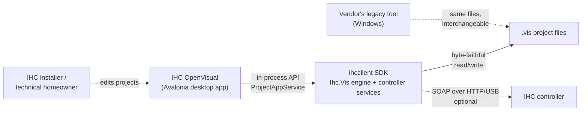

# IHC OpenVisual

> A modern, cross-platform, open-source desktop application called IHC OpenVisual for creating and editing IHC
> home-automation project files (`.vis`) — tested to be binary compatible with the project files of
> the vendor's legacy Windows-only authoring tool.

## Vision and Purpose

IHC OpenVisual exists to allow owners and installers of IHC installations to keep
maintaining them for the long term — on any modern desktop OS, in English using an open codebase.

## Key Features

| Feature | Benefit | Status |
|---------|---------|--------|
| Binary-compatible open/save of `.vis` projects | Files can move freely between IHC OpenVisual and the vendor tool with zero risk of corruption — byte-identical round-trips are enforced by an automated oracle test suite (measured, SDK engine) | Available (SDK engine) |
| Full project editing: localities, products, function blocks, links | The complete authoring workflow — model rooms, place wired/wireless devices, add logic blocks, wire inputs to outputs — in one two-pane workspace: **what is installed on the left, what it does on the right**, linked across the middle | Available; **aligning** — measured against the vendor side by side, with the divergences tracked in `stories/` |
| Function-block programming | Author control logic (typed variables, events, conditions, commands, enums, case structures) so installations do exactly what the household needs | Available; mode transition and structure are measured aligned, and the **authoring surfaces inside it have now been compared** (compare3) — the divergences are tracked as A-17 (internal-variable display), A-26 (sub-program name) and A-27 (locked-block authoring gate) |
| Built-in component catalog | The stock products and function blocks are embedded in the SDK — no vendor installation is required to create or extend a project | Available (SDK engine); **both halves are measured complete** — 72 function blocks and all 100 products. The gap is in the app's *insert menu*, which surfaces 88 of the 100 (F-055) |
| Modern flat-line SVG icon language + English help | A themeable (light/dark), accessible UI that new users can actually read: 44 purpose-designed glyphs plus context-sensitive English help | Icons available; help planned |

## Architecture Overview

IHC OpenVisual is a thin Avalonia MVVM desktop front-end over the repository's `ihcclient` SDK; all
file parsing, editing, validation, catalog, and controller communication live in the SDK.

**Technology stack:** C# / .NET 10, Avalonia UI 12 (Fluent theme, compiled bindings),
CommunityToolkit.Mvvm, `ihcclient` SDK (`Ihc.Vis` project engine + controller services).
**Deployment model:** locally installed desktop application for Windows, macOS, and Linux.
**Key integrations:** `.vis` project files (compatibility contract with the vendor tool); optional
live IHC controller access for project transfer via the SDK.

## Key Differentiators

IHC OpenVisual is the only open-source, cross-platform editor for IHC `.vis` project files that is
tested to be binary compatible with the vendor's own tool, enabling installers and homeowners to
maintain their installations without legacy Windows software.

| Differentiator | How It Compares | Evidence |
|---------------|----------------|----------|
| Binary compatibility, proven | Generic XML editors break the format; IHC OpenVisual's engine reproduces unchanged files byte-for-byte and mimics the vendor's save metadata | Committed oracle corpus incl. vendor-authored files; byte-fidelity test suites in `tests/safe_project_tests` (measured) |
| Cross-platform | The vendor tool runs on Windows only | .NET 10 + Avalonia; the underlying SDK already builds and tests on Windows/macOS/Linux in CI (measured for SDK; inferred for the app until it joins CI) |
| No vendor install required | Legacy workflow needs the vendor product catalog on disk | Stock catalog embedded in the SDK (`BuiltInCatalog`), generated and byte-verified from vendor definitions (measured) |
| Open source (Apache-2.0) | Vendor tool is closed and unsupported for extension | Public repository, permissive license |
| Modern, accessible UX | Legacy UI is Danish-only with 1990s-era raster icons and CHM help | English UI/help, 44 themeable flat-line SVG icons designed for 16 px legibility and non-color-alone state cues |

## What This Product Is Not

- **Not a vendor product.** Unofficial and unaffiliated with LK/Schneider Electric; no endorsement or support from them.
- **Not a runtime administration or monitoring tool.** Live dashboards, user administration, and scene administration remain with the vendor's other applications and this repo's other utilities;
- **Not a general smart-home hub.** No MQTT/Home Assistant/Matter integration — the scope is IHC project authoring.
- **Not a wireless commissioning tool (initially).** Placing wireless products in a project is in scope; RF linking/signal-testing of physical devices is out of scope until a wireless API exists.
- **Not a web or mobile app.** Desktop only.
- **Does not offer offline simulation**.

## Success Metrics

| Metric | Target | Measurement Method |
|--------|--------|-------------------|
| Round-trip fidelity | 100% byte-identical preserve-mode save across the committed oracle corpus, at app level | Automated byte-comparison tests (already green at SDK level — measured) |
| Vendor interop | Projects created/edited in IHC OpenVisual load and re-save cleanly in the vendor tool | Per-release acceptance check against the vendor application |
| Cross-platform health | Build + headless UI test suite green on Windows, macOS, Linux | CI workflow — the app is in the solution and `safe_visual_tests` runs on Windows (measured); the **headless UI suite is Windows-only** and `safe_project_tests` is **not yet in CI** (both are the remaining gaps) |
| Authoring coverage | Core epics (project lifecycle, localities, products, function blocks, links, programming) fully usable in the UI | Feature checklist per milestone + UI test coverage |
| Vendor behavioural parity | Every measured divergence from IHC Visual is either fixed, or granted as a deliberate exception by a story that cites the ruling | Side-by-side census against the live vendor tool; ledger in `tmp/comptest/out/RESULTS.md`, backlog A-1…A-29 *(added 2026-07-17: byte compatibility was already a metric, behavioural parity was not — and it is where the real gaps turned out to be)* |

---

# Part 2 — PRD-lite

## Product Context

IHC OpenVisual lives in the IHCClientSDK mono-repository as `applications/ihc_openvisual` and is the
primary consumer of the SDK's project-edit capability. The heavy lifting already exists and is
tested: the `Ihc.Vis` engine loads, validates, edits, creates, and saves `.vis` files with
byte-exact fidelity; `BuiltInCatalog` embeds the stock product/function-block library;
`ProjectAppService` is the application-facing facade and includes an optional bridge for
downloading/uploading projects from/to a live controller. The repository also ships `ihc_lab`, an
Avalonia GUI for exercising individual controller APIs, which established the repo's MVVM and
headless-UI-testing conventions that IHC OpenVisual follows.

The application has an **authoring UI in place across all sixteen epics** — project lifecycle,
localities, products, function blocks, links, programming mode, clipboard, undo/redo, reports and
catalog import — alongside the Avalonia project, MVVM scaffolding, the complete 44-glyph icon set with
design guidelines, an icon-to-element mapping for `.vis` content, and a headless test suite
(`tests/safe_visual_tests`). It targets .NET 10, **is** in `IHCClientSDK.sln`, and `safe_visual_tests`
**runs in CI** on Windows. What remains is **alignment, not construction**: this document and
`stories/` record the measured divergences from IHC Visual, and `RESULTS.md`'s backlog tracks them.

> *(**Corrected 2026-07-17**, was: "an incubating skeleton … the editing UI does not yet [exist] …
> not yet part of `IHCClientSDK.sln` or CI".* All three claims are stale, and **the vendor comparison
> is itself the disproof** — its two census phases drove IHC OpenVisual's real UI through product
> inserts, property dialogs, deletes with cascade confirmation, link drags, clipboard round-trips,
> programming-mode transitions and undo/redo. A skeleton cannot be censused. The solution/CI half was
> verified directly. Left uncorrected, this paragraph reads as *"nothing is built yet"* to anyone
> planning work.)*

## User Classes and Characteristics

| User Class | Characteristics | Frequency of Use | Technical Proficiency |
|-----------|-----------------|-------------------|---------------------|
| Professional installer | Knows the IHC domain deeply (products, wiring, logic blocks); may be new to this app but expects the legacy workflow's concepts | Weekly on customer projects | Domain: high · Software: medium |
| Technical homeowner | Knows software well; learns the IHC domain as they go; benefits most from English UI, help, and validation feedback | Bursts (renovations, tweaks) | Domain: low-medium · Software: high |
| Contributor / developer | Extends the app or SDK; needs strict layering (UI logic testable headlessly, engine untouched by UI concerns) | Ongoing | High |

## Operating Environment

- **Runtime**: .NET 10 desktop; Avalonia UI 12 with Fluent theme and Inter fonts.
- **Client platforms**: Windows 10/11, modern macOS, mainstream Linux desktop distributions.
- **Storage**: local file system only — `.vis` project files plus an automatic backup file; no database.
- **Network**: none required for authoring; optional HTTP(S)/USB access to an IHC v3.0 controller for project transfer (via the SDK).
- **Display**: standard desktop resolutions; light and dark themes.

## Constraints and Dependencies

### Design and Implementation Constraints

- **Binary compatibility is a hard contract.** Every file the app writes must be accepted by the vendor toolchain. All persistence goes through the SDK's serializer; the UI must never hand-roll XML. Preserve-mode saves of unchanged content must stay byte-identical; default saves re-stamp metadata exactly the way the vendor tool does.
- **The vendor application is the authoritative behavioural spec — with three bounded exceptions.** Where IHC Visual's observed behaviour and an IHC OpenVisual story disagree, **the story is the thing to fix**. The exceptions, set explicitly by the product owner on 2026-07-16:
  1. **IHC OpenVisual keeps its safety guards and error feedback** where the vendor is silent — they change nothing about *what* happens, only warn or explain. The vendor's silent linked-product delete and its silent illegal-paste are quirks **not** to copy. ⚠ **The exception is not a licence to add dialogs**: it covers *feedback*, and it does not reach an action that is already reversible — which is why US-020's specced unlock warning was deleted rather than built (FR-5.2).
  2. **Simulation stays out of scope** (F10), and is not re-litigated on parity grounds.
  3. **Vendor defects are not authoritative.** Its undo-of-unlock crash and its self-contradictory arrow-key help are not specs; IHC OpenVisual must degrade gracefully, not replicate them.

  *(**Added 2026-07-17.** This ruling governs every story in `stories/` and each one cites it, but it had never been recorded at product level — so the principle deciding what counts as a defect lived only in working notes. ⚠ Note it cuts **both** ways: it is why the delete confirmations survive, **and** why a story asserting something the vendor contradicts gets rewritten. Several already have.)*
- **A claim about the vendor must come from a measurement, not from its documentation or from symmetry.** Both have been caught wrong: the vendor's own help contradicts its app on the arrow keys, and reasoning "wireless products have no cables, so their dialog has no cable fields" was falsified by opening the dialog. Where a rule is unmeasured, stories say so and the code stays **permissive** rather than guessing.
- **All project mutations go through `ProjectAppService` / `ProjectEditor` sessions** on the SDK's immutable model; the UI holds element ids, not object references.
- **MVVM with compiled bindings; view-models contain no Avalonia types** where feasible, so logic tests can run without a UI session.
- **English is the product language** for UI text and help. Project file content (user's own names/notes, vendor catalog text) is data and is preserved verbatim, whatever language it is in.
- **Icon rules**: one flat-line SVG family (24-unit grid, `currentColor`, stroke-width 2, legible at 16 px); state is conveyed by color *plus* a glyph/decoration, never color alone. See the icon design guideline (linked in Part 4).
- **Repo-wide rules apply**: `TreatWarningsAsErrors`, no logging dependency inside the SDK (tracing only), test suites must be incapable of harming a live controller.

### Assumptions

- Users have `.vis` files from existing installations and/or an IHC v3.0 controller.
- One project open per window (single-project model, matching user expectations from the legacy workflow).
- The embedded catalog **is** equivalent to the vendor's stock catalog; genuinely custom components can be imported from `.def`/`.ifb` files. *(**Re-corrected 2026-07-17 — and the 2026-07-16 correction below was itself wrong.** Equivalence is the **measured state, not merely the goal**: the product half holds **all 100** of the vendor's products, including every one of the 12 the note below calls missing — verified directly in `BuiltInCatalog.Products.g.cs`. ⭐ **The defect was never in the catalog; it is in the app's menu builder**, which constructs three categories where the vendor has four and reaches the modem through a product-type filter instead of a category, so only 88 of the 100 surface in the *Insert* menu. The earlier note read a **menu walk** as a **catalog inventory** — a misattribution that would have sent someone to regenerate a catalog that was already complete. **E-7 is closed**; the fix is `MainWindowViewModel.BuildProductMenu()`, not the catalog. The **function-block** half was already measured verbatim — 72 blocks, categories and all. Evidence: `RESULTS.md` **F-055** (supersedes **F-028**, whose category-only walk produced the superseded claim that the product catalog "has no `Bus Produkter` category" and that "`IHC LED Dimmer 2 kanaler` appears nowhere") and F-042; backlog A-11. See US-010.)*

### Dependencies

- `ihcclient` project reference (engine, catalog, validation, controller services) — same repository, so no version skew.
- Avalonia 12 packages, CommunityToolkit.Mvvm.
- Offline simulation (out of scope, not slated — F10) would require a new program-execution engine that does not exist in the SDK yet — the largest open technical dependency were it ever taken on.
- Wireless RF commissioning depends on a wireless API that does not exist yet (explicitly out of scope until it does).

## System Features

Features are grouped into delivery milestones M1-M5. "Engine: available" means the SDK capability
exists and is tested today; the work is UI.

### F1 — Project lifecycle (M1)

**Description**: Create, open, save, and recover `.vis` projects safely.

**Functional Requirements**:

- FR-1.1: Create a new project from the built-in template (standard starting localities and built-in enumeration types) with no vendor installation present. *(Engine: available)*
- FR-1.2: Open an existing `.vis` file; exactly one project is open at a time; switching or closing prompts to save unsaved changes.
- FR-1.3: Save and Save-As. Saving an unchanged loaded project in preserve mode is byte-identical; a normal save re-stamps metadata exactly like the vendor tool. Writes are atomic — a failed save never corrupts the target file. *(Engine: available)*
- FR-1.4: A recent-projects list (at least the four most recent) is available for one-click reopening.
- FR-1.5: Automatic crash-recovery backup: written periodically and after bursts of changes, offered for recovery on restart after abnormal termination, and discarded on a clean close.

### F2 — Two-pane authoring workspace (M1)

**Description**: The main window presents the installation (physical) view and the functions
(logic) view side by side over the same locality structure.

> **The two panes are not two views of one menu model — each pane owns half the authoring vocabulary.**
> This is the workspace's central rule, inherited from IHC Visual, and it decides where every insert
> command belongs:
>
> | | **LEFT pane — Installation** | **RIGHT pane — Functions** |
> |---|---|---|
> | Shows | localities → **products** → pins | localities → **function blocks** → pins |
> | Owns the insert of | **products** (wired, wireless, special) | **function blocks** (library and empty) |
> | Answers | *what is physically installed, and where* | *what the installation does* |
>
> **The locality structure is shared** — every locality appears in **both** panes, in the same order, and
> a rename/add/delete shows up in both at once. What differs is what hangs beneath it, and therefore what
> each pane lets you insert: **a product is never inserted on the right, a function block never on the
> left.** Links are the one operation that deliberately spans the panes (F6), which is why the two are
> shown side by side rather than as tabs.

**Functional Requirements**:

- FR-2.1: Two tree panes — **Installation** (left: localities → products → pins) and **Functions** (right: localities → function blocks → pins) — over one shared locality structure, with a draggable splitter; a change to a locality reflects in both panes immediately.
- FR-2.1a: **Pane ownership of the insert vocabulary.** Products are inserted **only** from the Installation pane and function blocks **only** from the Functions pane; each pane offers exactly its own half **on the node's context menu**. A pane never offers a *context-menu* insert whose result it could not show. *(**Confirmed 2026-07-17 — the capture landed and the rule holds.** The vendor's Functions-pane locality menu was dumped and carries **both** function-block routes, mapping 1:1 onto IHC OpenVisual's existing items; its root menu is pane-**independent**. So the fix is to **pane-gate, not to delete** — and the earlier caution earned its keep, since reading the left pane's menu alone would have stripped the capability from **both** panes. Evidence: `RESULTS.md` **F-048**; backlog **A-5**. See US-068.)*
- FR-2.1b: **The menu bar is deliberately NOT pane-gated.** It offers the whole vocabulary regardless of which pane has focus or what is selected. The two surfaces answer different questions: a context menu answers *"what can I do to this?"*, the menu bar *"what can this app do?"*. *(**Added 2026-07-17** — FR-2.1a previously said "and on the menu bar", which measurement contradicts: IHC Visual's *Insert* menu is item-for-item identical with focus in either pane, with **nothing disabled**. The pane split is a **context-menu rule only**; do not generalise it. ⚠ IHC OpenVisual's own menu bar has not been dumped per-pane-focus, so the vendor side is measured and the app side is not. Evidence: `RESULTS.md` **F-049**, an open **E**. See US-044.)*
- FR-2.2: Every node renders a type icon from the flat-line set (per the icon-mapping doc) plus decorations for state (e.g. unconfigured/unlinked warning, locked block badge); variables show inline `name = value`.
- FR-2.3: Every command is reachable three equivalent ways: menu bar, context menu on the target node, and (where assigned) a keyboard shortcut; a documented keymap covers navigation, editing, properties, link-jumping, and pane switching.
- FR-2.4: A status bar confirms the result of the last action in a short sentence.
- FR-2.5: Light and dark themes; icon ink and state colors follow the theme tokens.

### F3 — Locality management (M2)

**Description**: Model the rooms/places of the installation.

**Functional Requirements**:

- FR-3.1: Add, rename (name + note properties), and delete localities; changes appear in both panes and are confirmed in the status bar.
- FR-3.2: Deleting a locality that still contains products or blocks requires explicit confirmation and cascades cleanly: contained elements and the links/logic references that point at them are removed consistently. *(Engine: available — link cascade)*

### F4 — Product management (M2)

**Description**: Place wired and wireless products from the catalog into localities, document
them, and address wired terminals.

**Functional Requirements**:

- FR-4.1: Insert any catalog product into a locality selected **in the Installation (left) pane** from categorized menus; the product appears there with its pins/sub-resources and their default values, and does **not** appear in the Functions pane (FR-2.1a). *(Engine: available — insert transform)*
- FR-4.2: Edit product documentation properties (name, placement, note, cable data, identification code, light group where applicable, and inclusion in the end-user report) in a properties dialog titled with the **product type**, opened on demand from the tree — inserting a product opens no dialog, matching IHC Visual. The **name** field is disabled when the placed element's `locked` attribute resolves to `yes`; the **placement** field is the vendor's `Placering` descriptor (free text with suggestions), **not** a room selector — a product's room is its position in the tree. *(Corrected 2026-07-16, was "opened automatically on insert": the vendor was measured **not** to auto-open — `RESULTS.md` F-027, backlog A-14. **Re-corrected 2026-07-17**: the name gate was stated as "gated by product **type**", which is the one implementation that gets it wrong — the two DTDs disagree on `locked`'s default, so a catalog-by-type lookup greys every product whose element omits the attribute. Read it off the **element**, resolved via the **project's** inline DTD — F-054, backlog A-15. `Placering` was also stated as "one of a fixed list"; it is an editable MRU combo with no fixed list to reproduce — F-054/F-056, backlog A-13. See US-011.)*
- FR-4.3: Configure input/output terminal addressing (data line + module terminal) with in-use indication, output initial values (normally-open/normally-closed semantics), per-terminal wire colour, and power-fail save-current-value behaviour. The address editor opens by **double-clicking a terminal row** or from a *Configure* button — two routes onto one sub-dialog. *(**Clarified 2026-07-17.** The row gesture is measured (**double**-click; single click only selects) — F-056, closing US-012's open `[R3]`. ⚠ **The word "wired" was removed deliberately**: the vendor's wireless product dialog **is** the wired dialog, and its terminal grids are enabled by the product's **shape** — whether it has inputs and/or outputs — not by its family. An input-only wireless sensor has an enabled `Indgange` grid. F-057. See US-012/US-014.)*
- FR-4.4: Wireless products can be inserted and documented **through the same properties dialog and the same field set as wired products** (FR-4.2/FR-4.3); products that are not yet fully configured/commissioned carry a visible warning decoration. (RF linking itself is out of scope — see Constraints.)
- FR-4.5: Catalog/project constraints are enforced at edit time via the validator (e.g. at most one modem product per project).

### F5 — Function blocks and library (M2)

**Description**: Insert ready-made logic blocks from the built-in catalog or start from an empty
block; manage a personal library.

**Functional Requirements**:

- FR-5.1: Insert stock function blocks from the categorized built-in library, or an empty block, into a locality selected **in the Functions (right) pane** — and only there; a block does **not** appear in the Installation pane (FR-2.1a). *(Engine: available)*
- FR-5.2: Stock (locked) blocks show a distinct badge and are read-only internally until explicitly unlocked, after which they behave like user blocks. **The unlock is silent and undoable** — no warning, and one *Undo* re-locks the block. *(**Clarified 2026-07-17.** IHC Visual also unlocks silently, but there the unlock is a **one-way door that crashes the application if you try to reverse it**. IHC OpenVisual's is an ordinary undoable edit, which is why it needs no warning — and why US-020's specced warning was **deleted rather than built**: its whole rationale was an irreversibility this app does not have. Evidence: `RESULTS.md` **F-064**, **F-065**, F-046. See US-020.)*
- FR-5.3: Save own blocks for reuse and maintain a favourites collection; import external component definitions (`.def`/`.ifb`) into the session catalog. *(Engine: available — catalog reader/composition)*

### F6 — Product ↔ function-block linking (M2)

**Description**: Wire physical products to logic by direct manipulation across the two panes.

**Functional Requirements**:

- FR-6.1: Create links by dragging one pin onto another (product input → block input; block output → product output); invalid targets are rejected with feedback.
- FR-6.1a: **Link legality is a data-flow rule, enforced in the SDK.** A link is legal iff the **source** produces a signal, the **target** consumes one, and **at least one end is a function-block pin** — two product pins never link directly, because routing product logic through a block *is* the IHC programming model. The rule is keyed on the pin's element kind and the **roles in the drag**, never on "kind matching". *(**Added 2026-07-17** — this product had no legality rule, and that was the gap: FR-6.1 said "invalid targets are rejected" without ever defining invalid, and the app checked **one of the three link families**, silently accepting a button wired straight to a lamp with no block in between. Measured over **15 cells / 3 families / 0 falsifications**. ⚠ **Do not restate this as "inputs↔inputs, outputs↔outputs"** — that mispredicts 3 of the 15 cells; the *same pin pair* is accepted one drag direction and refused the other. Enforced in the SDK, not the view-model, so a `.vis` stays valid whoever drives the editor. Evidence: `RESULTS.md` **F-058**/**F-059**/**F-060**; backlog **A-16**. See US-022.)*
- FR-6.2: Links display reciprocally: each end shows a link child naming the full path of the opposite end, with **direction carried by the row's icon** and the label left bare.
- FR-6.2a: **A link's halves are written in the vendor's measured orientation** — the dragged pin (the source/producer) owns the `link_from_resource` half; the pin dropped on (the target/consumer) owns the `link_to_resource` half. ⚠ The element names read backwards from the roles (a producer owns the *from* half), which is why writing them the intuitive way round is exactly the F-066 defect. The check and the write must agree on which end is which. *(**Added 2026-07-17 after IHC OpenVisual was found writing every link's two halves backwards** — a shape absent from all 397 links across the 21 authored vendor projects. It survived because the SDK primitive was correct and byte-tested, the inversion lived only in the untested app layer, and **removing the redundant `→`/`←` label prefix (FR-6.2) made both orientations render identically in the tree** — so every tree-based check was blind to it by construction. Only saving the file and reading the XML could see it. Independently confirmed by IHC Visual's own link-row arrow icons. Evidence: `RESULTS.md` **F-066**, **F-070**. See US-022.)*
- FR-6.3: Dropping onto a scene-capable output opens a dialog for the scene value (light level + ramp time for dimmers; on/off for relays) before the link is created.
- FR-6.4: A single action jumps from a link row to its opposite end in the other pane.

### F7 — Function-block programming (M3)

**Description**: Author the control logic inside a block.

**Functional Requirements**:

- FR-7.1: A per-block programming mode shows the block's variable sections (inputs, outputs, settings, internal variables) beside its program tree; entering/leaving it is a single action. **The configuration-mode view shows less**: a section with no members is not drawn, and **internal variables are a programming-mode section only**. **Entering programming mode on a locked (stock) block is view-only**: the program renders for reading, but every authoring command is gated on the block being unlocked and is **removed, not greyed**, matching the vendor. *(**Clarified 2026-07-17.** The first deep diff of the Functions pane found IHC OpenVisual drawing **+525 rows** the vendor does not — and ⭐ **the data underneath is perfect** (24/24 localities, every block count matching, 0 pin-count mismatches across 321 section pairs): the whole delta is chrome, accounted for exactly by the display rules. The empty-section rule is measured 30/30. The internal-variables rule is now measured **both** ways: the vendor shows internal variables in programming mode (four sections) and never in configuration mode (three), so the rule stands as written — closing **F-069** (E→B) makes A-17 an implementation-only bug. The **view-only locked block** is F-076/F-077 → backlog **A-27**: the vendor drops the program-insert command from a locked block's menu, while IHC OpenVisual currently lets an edit through and can even save a locked block the vendor could never produce. Evidence: `RESULTS.md` **F-068**/**F-069**/**F-076**/**F-077**. See US-018/US-020/US-026.)*
- FR-7.2: Add typed variables across the full resource palette (on/off, counters, integers, decimals, timers, time/date/weekday, temperature, light, humidity, energy, enumerations), with section placement rules enforced and per-variable name/note/initial value/persist-on-power-loss properties.
- FR-7.3: Build programs by dragging variables onto event/condition/command groups and picking the applicable operation: events are OR-combined; condition groups support AND/OR/NOT and nesting; commands execute in order, with separate true/false branches for conditional sub-programs.
- FR-7.4: Define project-global enumeration types with ordered named values; use case structures keyed on eligible variable types, with an else branch.
- FR-7.5: Support arithmetic command lines (one operation per line, decimal/integer conversion rules) and power-up events for restoring state after outages.

### F8 — Validation, undo, and integrity (M1 onward)

**Description**: Keep the project consistent and every edit reversible.

**Functional Requirements**:

- FR-8.1: Validate on demand and before save/transfer; findings are listed with severity and one-click navigation to the offending element. *(Engine: available — `ProjectAppService.Validate`)*
- FR-8.2: Unlimited undo/redo across all edit operations within a session. **Prefer making an irreversible action undoable over guarding it with a dialog** — no project mutation currently needs the guard. *(**Clarified 2026-07-17**: unlocking a stock block was the one action believed irreversible, and it is not — see FR-5.2. IHC OpenVisual survives the exact sequence that closes IHC Visual. Evidence: `RESULTS.md` **F-065**, F-046. See US-052.)*
- FR-8.3: Ids of existing elements are never renumbered or reused; deletions leave holes, matching vendor semantics. *(Engine: available — allocator invariants)*
- FR-8.4: **Catalog-owned structure is not editable.** A product's pins exist because its catalog type declares them, so they cannot be deleted, reordered, or inserted into — the commands are absent, and the engine refuses them whatever route asks. *(**Added 2026-07-17.** IHC OpenVisual currently deletes a product pin on request, **silently** when the pin is unlinked (the delete guard is link-triggered, so nothing fires), producing a six-button switch carrying five `dataline_input`s. The sixth physical button then has no element — unaddressable, unwireable, and **invisible in the tree**, since the row is simply absent. ✅ Link integrity survives (the cascade is correct: 740 halves, 0 dangling); what breaks is **catalog conformance**, which nothing checks today. IHC Visual offers no delete on any pin. Evidence: `RESULTS.md` **F-067**. See US-053/US-068.)*

### F9 — Controller transfer (M4)

**Description**: Move projects between the PC and a live controller.

**Functional Requirements**:

- FR-9.1: Send the open project to a connected controller with explicit confirmation before overwriting the controller's existing project, and progress/success feedback. *(Engine: available — upload bridge incl. validate-on-upload)*
- FR-9.2: Retrieve the project stored in a controller into the editor; disabled when the controller holds none. *(Engine: available — download bridge)*

### F10 — Offline simulation (out of scope — not slated)

**Description**: Validate behaviour on the PC before deployment. **Out of scope — not slated for
implementation** (consistent with *What This Product Is Not* above and `stories/08-simulation.md`):
this would require building a program-execution engine that does not exist in the SDK today. The
requirements below are retained as documentation only and would be refined in a separate design
document if the capability is ever scheduled.

**Functional Requirements**:

- FR-10.1: Start/stop an offline simulation of the open project; while simulating, editing is disabled and input/output state is shown by color (distinct on/off colors) plus glyph cues.
- FR-10.2: Drive inputs and block outputs interactively — momentary hold and toggle — and simulate a power-loss/power-up cycle.
- FR-10.3: Set breakpoints on program lines and step execution line by line.
- FR-10.4: Set the simulated clock and date to exercise time- and calendar-driven logic.
- FR-10.5: Capture a filterable activity log (events, conditions, commands, value changes) exportable to a file.

### F11 — Help and project documentation (M1 help shell; M5 reports)

**Description**: English help and installation documentation output.

**Functional Requirements**:

- FR-11.1: Context-sensitive English help: one action (e.g. `F1`) opens the topic for the selected element/view; all-new content, not a translation of vendor material.
- FR-11.2: Edit project-level information (project, customer, installer identity) stored in the file.
- FR-11.3 (M5): Generate installation (technical) and end-user (function) reports from entered documentation, printer-friendly, with optional installer logo.

## External Interface Requirements

### User Interfaces

Single main window with menu bar, toolbar, two tree panes — **Installation on the left** (products)
and **Functions on the right** (function blocks), over one shared locality structure (F2) — and a
status bar; modal dialogs for properties and confirmations. Keyboard-first: complete tasks are
achievable without a mouse (three-route command activation, FR-2.3). Accessibility: icons are decorative and always
accompanied by text labels; state is never signaled by color alone; both themes maintain
readable contrast at 16 px tree-row icon size.

### Software Interfaces

| System | Interface Type | Purpose | Data Format |
|--------|---------------|---------|-------------|
| `ihcclient` SDK (`ProjectAppService`, `ProjectEditor`, `ICatalog`, validator) | In-process .NET API | All load/edit/validate/save/catalog operations | Immutable element model |
| `.vis` project files | File I/O (via SDK only) | Persistence; compatibility contract with the vendor tool | XML with inline DTD, vendor encoding conventions |
| `.def` / `.ifb` catalog files | File I/O (via SDK only) | Optional import of external/custom component definitions | Vendor catalog formats |
| IHC controller (v3.0) | SOAP over HTTP(S)/USB via SDK services | Optional project send/retrieve (M4) | SOAP/XML (hidden by SDK) |

## Quality Attributes

| Attribute | Target | Measurement | Confidence |
|-----------|--------|-------------|-----------|
| Compatibility | 100% byte-identical preserve-mode round-trip over the committed oracle corpus; authored files accepted by the vendor tool | Byte-comparison test suites; per-release vendor-tool acceptance check | measured (SDK today); app-level inherits via exclusive SDK persistence |
| Reliability | No data loss on crash (recoverable backup ≤ 10 min old); no partial/corrupt file ever written | Backup lifecycle tests; atomic-save tests (SDK) | measured (engine) / planned (app backup) |
| Performance | Open + render the largest committed oracle project (~236 KB) in < 2 s; save < 1 s, on typical developer hardware | Stopwatch assertions in UI tests once implemented | hypothesis (targets, unmeasured) |
| Usability | All authoring tasks completable via keyboard; icons legible at 16 px; light + dark themes | Headless UI tests + icon render checks + manual inspection | inferred (icon set already tuned/rendered at 16 px) |
| Portability | Same feature set and green test suite on Windows/macOS/Linux | CI matrix once the app joins the solution/CI | measured for SDK; planned for app |
| Maintainability | Zero build warnings (warnings-as-errors); view-model logic testable without UI; engine untouched by UI concerns | Build gates; suite layering (`safe_unit_tests` vs `safe_visual_tests`) | measured (gates exist) |

## Data Requirements

### Data Model Overview

The only persistent artifact is the `.vis` project file: an XML document with an inline DTD
holding the full installation (localities, products, function blocks, links, programs, project
metadata) as one element tree with stable hexadecimal ids. In memory the SDK exposes it as an
immutable tree; edits happen in editor sessions that produce new snapshots (enabling undo). A
sibling backup file exists between crashes and clean closes. The embedded catalog is read-only
compiled-in data.

### Data Integrity and Retention

- **Integrity**: atomic saves; validator gate before save/transfer; ids never reused.
- **Retention**: project files belong to the user on their file system; the app keeps no hidden copies beyond the crash backup, which is deleted on clean close.
- **Privacy**: project info may contain customer names/addresses. The app sends no file content anywhere; optional telemetry (if ever enabled by the host) must not include project data. Controller credentials are handled by SDK settings encryption, never stored in project files.

## Glossary

| Term | Definition |
|------|-----------|
| IHC controller | The physical unit running a home installation; executes the deployed project. |
| `.vis` file | The XML project file (with inline DTD) holding a controller's complete configuration. |
| Locality | A room/place node organizing products and function blocks. Localities are the **shared spine of both panes** — the same locality appears in each, holding its products on the left and its blocks on the right. |
| Installation pane | The **left** tree: localities → products → pins. The physical view — what is installed and where. **Products are inserted here, and only here** (FR-2.1a). |
| Functions pane | The **right** tree: localities → function blocks → pins. The logic view — what the installation does. **Function blocks are inserted here, and only here** (FR-2.1a). |
| Product | A physical device definition (switch, lamp output, sensor, …) instantiated from the catalog into a locality. Lives in the **Installation (left)** pane. |
| Function block | A reusable logic component with typed pins, variables, and programs. Lives in the **Functions (right)** pane. |
| Pin / resource | An addressable input/output/variable on a product or block; the endpoint of links. A **product's** pins are declared by its catalog type and are **not** independently editable — not deletable, not reorderable (FR-8.4). A **block's** variables are authored (F7). |
| Link | A **directed** connection routing a signal from a **source** pin to a **target** pin. Its two halves record the direction: the **source** carries the `link_from_resource` half, the **target** the `link_to_resource` half — the element names read backwards from the roles (FR-6.2a). Legality is a data-flow rule, not a kind match (FR-6.1a). |
| Scene / scenario link | A link carrying a preset (light level + ramp, or on/off) recalled by one trigger. A **distinct link family** — the data-flow rule in FR-6.1a is measured over the other three and does not cover it. |
| Catalog | The library of stock product and function-block definitions; embedded in the SDK. Distinct from the **insert menu**, which is the app's *presentation* of the catalog and can differ from it — as it does today (see Assumptions). |
| Locked (stock) block | A catalog-supplied block that is read-only until explicitly unlocked. The unlock is silent and **undoable** (FR-5.2). |
| `locked` (product attribute) | Per-element flag deciding whether a placed product's *Name* is editable. Resolved against the **project's own inline DTD** (default `no`), **not** the catalog's (default `yes`) — the catalog value is only the seed written at insert time (FR-4.2). |
| Preserve save | The byte-identical save mode for unchanged content; default save re-stamps metadata like the vendor tool. |

---

# Part 3 — Test Information

## Test Automation Approach

**Strategy**: test pyramid on top of an already-tested engine — the byte-fidelity and editing
semantics are guaranteed by SDK suites, so app testing concentrates on view-model logic and UI
behaviour. New features follow the repository's TDD process; bugs get a failing reproduction test
before the fix.
**Frameworks**: NUnit, `Avalonia.Headless.NUnit` (`[AvaloniaTest]`) for UI, FakeItEasy for
mocking (only low-level `IIHCApiService` services may be mocked — application services are always
real), CsCheck for property-based tests in the unit suite.
**CI/CD**: GitHub Actions (`build-validation.yml`) builds the solution on Ubuntu/Windows/macOS and
runs the unit suite everywhere, plus the lab UI suite and `safe_visual_tests` on Windows.
**Remaining gap:** `safe_project_tests` — the engine-level byte-fidelity suite, and the regression gate
for every `.vis` change — **is still not in CI** and runs locally only. *(Corrected 2026-07-17, was:
"`ihc_openvisual` and `safe_visual_tests` are not yet in the solution or CI" — both are, verified
directly in `IHCClientSDK.sln` and `build-validation.yml`. The engine suite's absence is the real
gap, and it is the more consequential one: it is what guards binary compatibility.)*

| Test Level | Suite | Scope | Automation | Execution Frequency |
|-----------|-------|-------|-----------|-------------------|
| Engine (project files) | `tests/safe_project_tests` | Byte fidelity, editing, catalog, validation against oracle corpus | Automated | Locally on every change; CI inclusion planned |
| Unit | `tests/safe_unit_tests` | SDK + app-service/view-model logic, controller-free, mocked API services | Automated | Every PR, all three OSes (CI) |
| UI (headless) | `tests/safe_visual_tests` | IHC OpenVisual windows/view-models under headless Avalonia | Automated | Every PR, Windows (CI) |
| Controller integration | `tests/safe_integration_tests` | SDK against a real controller, state-safe operations only | Automated, on demand | Manual, before releases |
| Vendor interop acceptance | manual procedure | Open/re-save app-authored projects in the vendor tool | Manual | Per release |

All suites are `safe_*`: they must be incapable of changing state on a live controller; only the
integration suite may talk to one at all.

## Test Oracles

| Oracle Type | Application | Example |
|------------|-------------|---------|
| Committed reference files (byte comparison) | Round-trip and authoring fidelity | Loading an oracle `.vis` and preserve-saving must reproduce the file byte-for-byte; scripted edit sequences must reproduce vendor-saved result files exactly |
| Vendor application as ultimate oracle | Interop acceptance | The vendor tool must open, accept, and cleanly re-save files IHC OpenVisual wrote (oracle corpus files were authored/verified against the live vendor tool) |
| Invariant checking | Editing semantics | Id allocation is monotonic and never reuses freed ids; links are always reciprocal; validator findings for known-bad inputs |
| Known-answer tests | Templates and catalog | A new empty project equals the known template output; embedded catalog components byte-match their vendor definitions |
| Property-based properties | Serialization robustness | Encode/decode round-trip properties over generated text (CsCheck) |
| Expected UI state | Headless UI tests | Window XAML loads and binds; tree/view-model state matches expectations after simulated user actions; screenshot-on-failure diagnostics (pattern established in the lab suite) |

## Test Data

**Approach**: committed fixture corpus, no generation at test time for fidelity tests, copyright free.
**Availability**: everything needed is in the repository — no controller, no vendor install, and no
private data required to run the engine, unit, and UI suites.
**Sensitive data handling**: fixtures contain no credentials or personal data; `ihcsettings.json`
(endpoints/credentials for integration tests) is untracked, with committed templates only; UI tests
use faked services behind a reserved mock endpoint scheme.

| Data Category | Source | Refresh Frequency |
|--------------|--------|-------------------|
| Authentic `.vis` oracles (incl. large ~236 KB project and vendor-saved edit-result files) | Captured from the live vendor tool, committed under `tests/safe_project_tests/testdata/` | Frozen; extended when new gaps are found |
| Synthetic component definitions (`.def`/`.ifb`) | Hand-authored, copyright-free, committed | As features require |
| Catalog generator inputs | Vendor install (dev-time only, via `ihc_catalog_codegen`); outputs committed and fingerprint-gated | On catalog regeneration only |
| UI test fixtures | Created in-test from the SDK's new-project template + fakes | Per test run |

---

# Part 4 — Links and References

## Source Code

| Repository / Path | Purpose | Access |
|-----------|---------|--------|
| <https://github.com/mmc41/IHCClientSDK> | Mono-repo containing the app and SDK | Public GitHub |
| `applications/ihc_openvisual/` | The IHC OpenVisual application (Avalonia UI, assets, docs) | In repo |
| `ihcclient/` (`src/vis/`, `src/app/services/`) | Project-file engine, catalog, `ProjectAppService` backend | In repo |
| `tests/safe_visual_tests/`, `tests/safe_project_tests/`, `tests/safe_unit_tests/` | App UI, engine, and unit test suites | In repo |
| `utilities/ihc_lab/` | Sibling Avalonia app; established MVVM + headless-test conventions | In repo |

## Design Documents

| Document | Location | Status |
|----------|----------|--------|
| **Epics & user stories (E1–E16, US-NNN)** — the implementation spec; **start here for any feature** | `applications/ihc_openvisual/docs/stories/` | Current (2026-07-17) |
| **Vendor comparison ledger** — every measured IHC Visual ↔ IHC OpenVisual divergence, classified, with the alignment backlog A-1…A-29 | `tmp/comptest/out/RESULTS.md`, `alignment-backlog.md` | Current (2026-07-17); working notes, not a deliverable |
| Repository architecture overview | `ARCHITECTURE.md` | Current (2026-07-10) |
| Icon design guidelines (flat-line SVG family) | `applications/ihc_openvisual/docs/icons_design.md` | Current |
| Icon selection reference (`.vis` element → SVG) | `applications/ihc_openvisual/docs/icon_codes.md` | Current |
| Test-data corpus overview | `tests/safe_project_tests/testdata/testdataoverview.md` | Current |
| Repo README (project status, disclaimers, setup) | `README.md` | Current |
| Agent/contributor instructions | `CLAUDE.md` | Partially stale (predates some SDK changes) |
| Simulation-engine design (out of scope, not slated — F10) | Not yet created | TBD |
| Keymap specification (FR-2.3) | Not yet created | TBD — now higher priority (keyboard gaps A-6 F4-jump, A-9/A-10 confirm-dialog keys, A-28 F6 pane-switch) |

## Architecture Diagrams

| Diagram | Location | Scope |
|---------|----------|-------|
| System context (Mermaid) | This document, Architecture Overview | C4 Context level |
| Whole-repo layering (textual) | `ARCHITECTURE.md` — "Layer Boundaries" | Container level, prose |
| App-internal component diagram | Not yet created | TBD |

## Standards and Specifications

- Apache-2.0 — repository license (`LICENSE.md`).
- .NET 10 / Avalonia UI 12 — runtime and UI framework baselines for this app.
- WCAG-informed icon rules — state never signaled by color alone; decorative icons always paired with text labels (see icon design guidelines).
- Vendor `.vis` / `.def` / `.ifb` file formats — undocumented; treated as a compatibility contract enforced by the oracle test corpus rather than a written spec.
